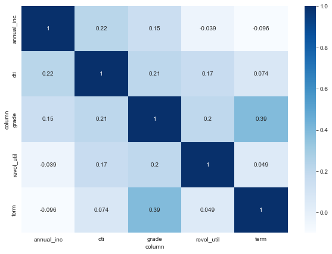
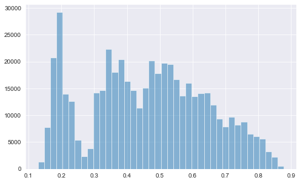
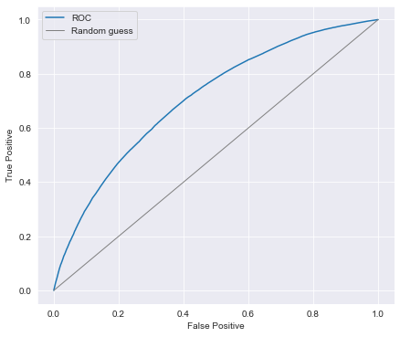
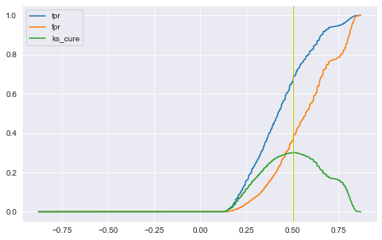
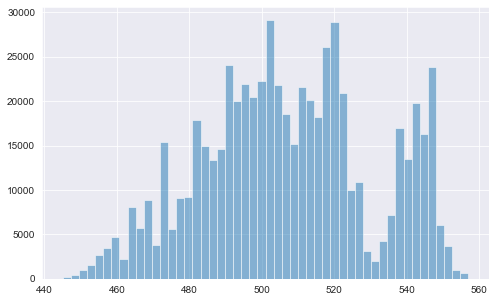

# Quantitive-Risk-Score-Table
Credit Score Card
```python
import numpy as np
import pandas as pd
import matplotlib.pyplot as plt
import seaborn as sns
from pylab import mpl
import matplotlib

%matplotlib inline

sns.set_style('darkgrid')
mpl.rcParams['figure.figsize'] = (8, 5)
```


```python
data = pd.read_csv("data_output2.csv",index_col=0)
```

## 1. 预处理


```python
data.groupby("dti")["dti"].count()
```


    dti
    (-1.0, 5.0]      23973
    (10.0, 16.0]    133196
    (16.0, 21.0]    139500
    (21.0, 27.0]    110801
    (27.0, 32.0]     73115
    (32.0, 38.0]     36789
    (38.0, 43.0]      8377
    (43.0, 49.0]      1217
    (49.0, 54.0]      1684
    (5.0, 10.0]      83130
    Name: dti, dtype: int64


```python
data.dtypes
```


    term             object
    grade          category
    purpose          object
    loan_status      object
    annual_inc       object
    dti              object
    pub_rec          object
    revol_util       object
    dtype: object


```python
# grade 数据类型转换
from pandas.api.types import CategoricalDtype
data['grade'] = data['grade'].astype(CategoricalDtype(ordered=True))# 将 grade 列设置为有序分类数据
data.grade.head()
```


    0    C
    1    C
    2    B
    4    F
    5    C
    Name: grade, dtype: category
    Categories (7, object): ['A' < 'B' < 'C' < 'D' < 'E' < 'F' < 'G']


```python
data.groupby('grade').grade.count()
```


    grade
    A    117025
    B    173213
    C    174804
    D     86041
    E     42915
    F     13437
    G      4347
    Name: grade, dtype: int64


```python
annual_inc_dtype = CategoricalDtype(categories=['(-300.0, 30000.0]', '(30000.0, 60000.0]', '(60000.0, 90000.0]', '(90000.0, 119900.0]',
       '(119900.0, 149900.0]', '(149900.0, 179900.0]', '(179900.0, 209900.0]',  '(209900.0, 239900.0]', '(239900.0, 269900.0]', '(269900.0, 299800.0]'], ordered=True)
data['annual_inc'] = data['annual_inc'].astype(annual_inc_dtype)
data['annual_inc'].head()
```


    0     (30000.0, 60000.0]
    1     (60000.0, 90000.0]
    2     (60000.0, 90000.0]
    4    (90000.0, 119900.0]
    5     (30000.0, 60000.0]
    Name: annual_inc, dtype: category
    Categories (10, object): ['(-300.0, 30000.0]' < '(30000.0, 60000.0]' < '(60000.0, 90000.0]' < '(90000.0, 119900.0]' ... '(179900.0, 209900.0]' < '(209900.0, 239900.0]' < '(239900.0, 269900.0]' < '(269900.0, 299800.0]']


```python
data.dtypes
```


    term             object
    grade          category
    purpose          object
    loan_status      object
    annual_inc     category
    dti              object
    pub_rec          object
    revol_util       object
    dtype: object


```python
data.head()
```


<div>
<style scoped>
    .dataframe tbody tr th:only-of-type {
        vertical-align: middle;
    }

    .dataframe tbody tr th {
        vertical-align: top;
    }

    .dataframe thead th {
        text-align: right;
    }
</style>
<table border="1" class="dataframe">
  <thead>
    <tr style="text-align: right;">
      <th></th>
      <th>term</th>
      <th>grade</th>
      <th>purpose</th>
      <th>loan_status</th>
      <th>annual_inc</th>
      <th>dti</th>
      <th>pub_rec</th>
      <th>revol_util</th>
    </tr>
  </thead>
  <tbody>
    <tr>
      <th>0</th>
      <td>36 months</td>
      <td>C</td>
      <td>debt_consolidation</td>
      <td>Fully Paid</td>
      <td>(30000.0, 60000.0]</td>
      <td>(5.0, 10.0]</td>
      <td>(-0.002, 0.9]</td>
      <td>(19.0, 39.0]</td>
    </tr>
    <tr>
      <th>1</th>
      <td>36 months</td>
      <td>C</td>
      <td>small_business</td>
      <td>Fully Paid</td>
      <td>(60000.0, 90000.0]</td>
      <td>(16.0, 21.0]</td>
      <td>(-0.002, 0.9]</td>
      <td>(-0.0, 19.0]</td>
    </tr>
    <tr>
      <th>2</th>
      <td>60 months</td>
      <td>B</td>
      <td>home_improvement</td>
      <td>Fully Paid</td>
      <td>(60000.0, 90000.0]</td>
      <td>(10.0, 16.0]</td>
      <td>(-0.002, 0.9]</td>
      <td>(39.0, 58.0]</td>
    </tr>
    <tr>
      <th>4</th>
      <td>60 months</td>
      <td>F</td>
      <td>major_purchase</td>
      <td>Fully Paid</td>
      <td>(90000.0, 119900.0]</td>
      <td>(21.0, 27.0]</td>
      <td>(-0.002, 0.9]</td>
      <td>(58.0, 77.0]</td>
    </tr>
    <tr>
      <th>5</th>
      <td>36 months</td>
      <td>C</td>
      <td>debt_consolidation</td>
      <td>Fully Paid</td>
      <td>(30000.0, 60000.0]</td>
      <td>(10.0, 16.0]</td>
      <td>(-0.002, 0.9]</td>
      <td>(58.0, 77.0]</td>
    </tr>
  </tbody>
</table>
</div>


```python
data['term'] = data['term'].astype(CategoricalDtype(ordered=True))# 将 grade 列设置为有序分类数据
data.term.head()
```


    0     36 months
    1     36 months
    2     60 months
    4     60 months
    5     36 months
    Name: term, dtype: category
    Categories (2, object): [' 36 months' < ' 60 months']


```python
data.info
```


    <bound method DataFrame.info of                term grade             purpose  loan_status  \
    0         36 months     C  debt_consolidation   Fully Paid   
    1         36 months     C      small_business   Fully Paid   
    2         60 months     B    home_improvement   Fully Paid   
    4         60 months     F      major_purchase   Fully Paid   
    5         36 months     C  debt_consolidation   Fully Paid   
    ...             ...   ...                 ...          ...   
    1048570   36 months     D         credit_card  Charged Off   
    1048571   36 months     B  debt_consolidation   Fully Paid   
    1048572   36 months     B  debt_consolidation   Fully Paid   
    1048573   36 months     A  debt_consolidation   Fully Paid   
    1048574   36 months     A    home_improvement   Fully Paid   
    
                       annual_inc           dti        pub_rec    revol_util  
    0          (30000.0, 60000.0]   (5.0, 10.0]  (-0.002, 0.9]  (19.0, 39.0]  
    1          (60000.0, 90000.0]  (16.0, 21.0]  (-0.002, 0.9]  (-0.0, 19.0]  
    2          (60000.0, 90000.0]  (10.0, 16.0]  (-0.002, 0.9]  (39.0, 58.0]  
    4         (90000.0, 119900.0]  (21.0, 27.0]  (-0.002, 0.9]  (58.0, 77.0]  
    5          (30000.0, 60000.0]  (10.0, 16.0]  (-0.002, 0.9]  (58.0, 77.0]  
    ...                       ...           ...            ...           ...  
    1048570    (30000.0, 60000.0]  (32.0, 38.0]  (-0.002, 0.9]  (58.0, 77.0]  
    1048571  (119900.0, 149900.0]  (21.0, 27.0]  (-0.002, 0.9]  (58.0, 77.0]  
    1048572    (60000.0, 90000.0]  (21.0, 27.0]  (-0.002, 0.9]  (39.0, 58.0]  
    1048573    (30000.0, 60000.0]  (21.0, 27.0]  (-0.002, 0.9]  (19.0, 39.0]  
    1048574    (60000.0, 90000.0]   (5.0, 10.0]     (0.9, 1.9]  (-0.0, 19.0]  
    
    [611782 rows x 8 columns]>


```python
dti_dtype = CategoricalDtype(categories=['(-1.0, 5.0]', '(5.0, 10.0]', '(10.0, 16.0]', '(16.0, 21.0]',
       '(21.0, 27.0]', '(27.0, 32.0]', '(32.0, 38.0]', '(38.0, 43.0]', '(43.0, 49.0]', '(49.0, 54.0]'], ordered=True)
data['dti'] = data['dti'].astype(dti_dtype)
```


```python
data.groupby("dti")["dti"].count()
```


    dti
    (-1.0, 5.0]      23973
    (5.0, 10.0]      83130
    (10.0, 16.0]    133196
    (16.0, 21.0]    139500
    (21.0, 27.0]    110801
    (27.0, 32.0]     73115
    (32.0, 38.0]     36789
    (38.0, 43.0]      8377
    (43.0, 49.0]      1217
    (49.0, 54.0]      1684
    Name: dti, dtype: int64


```python
data.dtypes
```


    term           category
    grade          category
    purpose          object
    loan_status      object
    annual_inc     category
    dti            category
    pub_rec          object
    revol_util       object
    dtype: object


```python
data.head()
```


<div>
<style scoped>
    .dataframe tbody tr th:only-of-type {
        vertical-align: middle;
    }

    .dataframe tbody tr th {
        vertical-align: top;
    }

    .dataframe thead th {
        text-align: right;
    }
</style>
<table border="1" class="dataframe">
  <thead>
    <tr style="text-align: right;">
      <th></th>
      <th>term</th>
      <th>grade</th>
      <th>purpose</th>
      <th>loan_status</th>
      <th>annual_inc</th>
      <th>dti</th>
      <th>pub_rec</th>
      <th>revol_util</th>
    </tr>
  </thead>
  <tbody>
    <tr>
      <th>0</th>
      <td>36 months</td>
      <td>C</td>
      <td>debt_consolidation</td>
      <td>Fully Paid</td>
      <td>(30000.0, 60000.0]</td>
      <td>(5.0, 10.0]</td>
      <td>(-0.002, 0.9]</td>
      <td>(19.0, 39.0]</td>
    </tr>
    <tr>
      <th>1</th>
      <td>36 months</td>
      <td>C</td>
      <td>small_business</td>
      <td>Fully Paid</td>
      <td>(60000.0, 90000.0]</td>
      <td>(16.0, 21.0]</td>
      <td>(-0.002, 0.9]</td>
      <td>(-0.0, 19.0]</td>
    </tr>
    <tr>
      <th>2</th>
      <td>60 months</td>
      <td>B</td>
      <td>home_improvement</td>
      <td>Fully Paid</td>
      <td>(60000.0, 90000.0]</td>
      <td>(10.0, 16.0]</td>
      <td>(-0.002, 0.9]</td>
      <td>(39.0, 58.0]</td>
    </tr>
    <tr>
      <th>4</th>
      <td>60 months</td>
      <td>F</td>
      <td>major_purchase</td>
      <td>Fully Paid</td>
      <td>(90000.0, 119900.0]</td>
      <td>(21.0, 27.0]</td>
      <td>(-0.002, 0.9]</td>
      <td>(58.0, 77.0]</td>
    </tr>
    <tr>
      <th>5</th>
      <td>36 months</td>
      <td>C</td>
      <td>debt_consolidation</td>
      <td>Fully Paid</td>
      <td>(30000.0, 60000.0]</td>
      <td>(10.0, 16.0]</td>
      <td>(-0.002, 0.9]</td>
      <td>(58.0, 77.0]</td>
    </tr>
  </tbody>
</table>
</div>


```python
data['purpose'] = data['purpose'].astype(CategoricalDtype(ordered=False))# 将 grade 列设置为有序分类数据
data.purpose.head()
```


    0    debt_consolidation
    1        small_business
    2      home_improvement
    4        major_purchase
    5    debt_consolidation
    Name: purpose, dtype: category
    Categories (14, object): ['car', 'credit_card', 'debt_consolidation', 'educational', ..., 'renewable_energy', 'small_business', 'vacation', 'wedding']


```python
data.pub_rec.unique()
```


    array(['(-0.002, 0.9]', '(0.9, 1.9]', '(1.9, 2.2]'], dtype=object)


```python
pub_rec_dtype = CategoricalDtype(categories=['(-0.002, 0.9]', '(0.9, 1.9]', '(1.9, 2.2]'], ordered=True)
data['pub_rec'] = data['pub_rec'].astype(pub_rec_dtype)
```


```python
data.revol_util.unique()
```


    array(['(19.0, 39.0]', '(-0.0, 19.0]', '(39.0, 58.0]', '(58.0, 77.0]',
           '(77.0, 96.0]', '(96.0, 116.0]', '(116.0, 193.0]'], dtype=object)


```python
revol_util_dtype = CategoricalDtype(categories=['(-0.0, 19.0]','(19.0, 39.0]', '(39.0, 58.0]', '(58.0, 77.0]',
       '(77.0, 96.0]', '(96.0, 116.0]', '(116.0, 193.0]'], ordered=True)
data['revol_util'] = data['revol_util'].astype(revol_util_dtype)
```


```python
data.dtypes
```


    term           category
    grade          category
    purpose        category
    loan_status      object
    annual_inc     category
    dti            category
    pub_rec        category
    revol_util     category
    dtype: object


```python
## 输出数据类型转换后的table
data_classification = data
data_classification
```


<div>
<style scoped>
    .dataframe tbody tr th:only-of-type {
        vertical-align: middle;
    }

    .dataframe tbody tr th {
        vertical-align: top;
    }

    .dataframe thead th {
        text-align: right;
    }
</style>
<table border="1" class="dataframe">
  <thead>
    <tr style="text-align: right;">
      <th></th>
      <th>term</th>
      <th>grade</th>
      <th>purpose</th>
      <th>loan_status</th>
      <th>annual_inc</th>
      <th>dti</th>
      <th>pub_rec</th>
      <th>revol_util</th>
    </tr>
  </thead>
  <tbody>
    <tr>
      <th>0</th>
      <td>36 months</td>
      <td>C</td>
      <td>debt_consolidation</td>
      <td>Fully Paid</td>
      <td>(30000.0, 60000.0]</td>
      <td>(5.0, 10.0]</td>
      <td>(-0.002, 0.9]</td>
      <td>(19.0, 39.0]</td>
    </tr>
    <tr>
      <th>1</th>
      <td>36 months</td>
      <td>C</td>
      <td>small_business</td>
      <td>Fully Paid</td>
      <td>(60000.0, 90000.0]</td>
      <td>(16.0, 21.0]</td>
      <td>(-0.002, 0.9]</td>
      <td>(-0.0, 19.0]</td>
    </tr>
    <tr>
      <th>2</th>
      <td>60 months</td>
      <td>B</td>
      <td>home_improvement</td>
      <td>Fully Paid</td>
      <td>(60000.0, 90000.0]</td>
      <td>(10.0, 16.0]</td>
      <td>(-0.002, 0.9]</td>
      <td>(39.0, 58.0]</td>
    </tr>
    <tr>
      <th>4</th>
      <td>60 months</td>
      <td>F</td>
      <td>major_purchase</td>
      <td>Fully Paid</td>
      <td>(90000.0, 119900.0]</td>
      <td>(21.0, 27.0]</td>
      <td>(-0.002, 0.9]</td>
      <td>(58.0, 77.0]</td>
    </tr>
    <tr>
      <th>5</th>
      <td>36 months</td>
      <td>C</td>
      <td>debt_consolidation</td>
      <td>Fully Paid</td>
      <td>(30000.0, 60000.0]</td>
      <td>(10.0, 16.0]</td>
      <td>(-0.002, 0.9]</td>
      <td>(58.0, 77.0]</td>
    </tr>
    <tr>
      <th>...</th>
      <td>...</td>
      <td>...</td>
      <td>...</td>
      <td>...</td>
      <td>...</td>
      <td>...</td>
      <td>...</td>
      <td>...</td>
    </tr>
    <tr>
      <th>1048570</th>
      <td>36 months</td>
      <td>D</td>
      <td>credit_card</td>
      <td>Charged Off</td>
      <td>(30000.0, 60000.0]</td>
      <td>(32.0, 38.0]</td>
      <td>(-0.002, 0.9]</td>
      <td>(58.0, 77.0]</td>
    </tr>
    <tr>
      <th>1048571</th>
      <td>36 months</td>
      <td>B</td>
      <td>debt_consolidation</td>
      <td>Fully Paid</td>
      <td>(119900.0, 149900.0]</td>
      <td>(21.0, 27.0]</td>
      <td>(-0.002, 0.9]</td>
      <td>(58.0, 77.0]</td>
    </tr>
    <tr>
      <th>1048572</th>
      <td>36 months</td>
      <td>B</td>
      <td>debt_consolidation</td>
      <td>Fully Paid</td>
      <td>(60000.0, 90000.0]</td>
      <td>(21.0, 27.0]</td>
      <td>(-0.002, 0.9]</td>
      <td>(39.0, 58.0]</td>
    </tr>
    <tr>
      <th>1048573</th>
      <td>36 months</td>
      <td>A</td>
      <td>debt_consolidation</td>
      <td>Fully Paid</td>
      <td>(30000.0, 60000.0]</td>
      <td>(21.0, 27.0]</td>
      <td>(-0.002, 0.9]</td>
      <td>(19.0, 39.0]</td>
    </tr>
    <tr>
      <th>1048574</th>
      <td>36 months</td>
      <td>A</td>
      <td>home_improvement</td>
      <td>Fully Paid</td>
      <td>(60000.0, 90000.0]</td>
      <td>(5.0, 10.0]</td>
      <td>(0.9, 1.9]</td>
      <td>(-0.0, 19.0]</td>
    </tr>
  </tbody>
</table>
<p>611782 rows × 8 columns</p>
</div>


# 2. 特征工程

### 2.1 WoE编码转换


```python
# 统计样本中好坏数据的数量
data.groupby('loan_status').loan_status.count()
```


    loan_status
    Charged Off    129187
    Fully Paid     482595
    Name: loan_status, dtype: int64


```python
data_labeled = data.copy()
```


```python
data_labeled.head()
```


<div>
<style scoped>
    .dataframe tbody tr th:only-of-type {
        vertical-align: middle;
    }

    .dataframe tbody tr th {
        vertical-align: top;
    }

    .dataframe thead th {
        text-align: right;
    }
</style>
<table border="1" class="dataframe">
  <thead>
    <tr style="text-align: right;">
      <th></th>
      <th>term</th>
      <th>grade</th>
      <th>purpose</th>
      <th>loan_status</th>
      <th>annual_inc</th>
      <th>dti</th>
      <th>pub_rec</th>
      <th>revol_util</th>
    </tr>
  </thead>
  <tbody>
    <tr>
      <th>0</th>
      <td>36 months</td>
      <td>C</td>
      <td>debt_consolidation</td>
      <td>Fully Paid</td>
      <td>(30000.0, 60000.0]</td>
      <td>(5.0, 10.0]</td>
      <td>(-0.002, 0.9]</td>
      <td>(19.0, 39.0]</td>
    </tr>
    <tr>
      <th>1</th>
      <td>36 months</td>
      <td>C</td>
      <td>small_business</td>
      <td>Fully Paid</td>
      <td>(60000.0, 90000.0]</td>
      <td>(16.0, 21.0]</td>
      <td>(-0.002, 0.9]</td>
      <td>(-0.0, 19.0]</td>
    </tr>
    <tr>
      <th>2</th>
      <td>60 months</td>
      <td>B</td>
      <td>home_improvement</td>
      <td>Fully Paid</td>
      <td>(60000.0, 90000.0]</td>
      <td>(10.0, 16.0]</td>
      <td>(-0.002, 0.9]</td>
      <td>(39.0, 58.0]</td>
    </tr>
    <tr>
      <th>4</th>
      <td>60 months</td>
      <td>F</td>
      <td>major_purchase</td>
      <td>Fully Paid</td>
      <td>(90000.0, 119900.0]</td>
      <td>(21.0, 27.0]</td>
      <td>(-0.002, 0.9]</td>
      <td>(58.0, 77.0]</td>
    </tr>
    <tr>
      <th>5</th>
      <td>36 months</td>
      <td>C</td>
      <td>debt_consolidation</td>
      <td>Fully Paid</td>
      <td>(30000.0, 60000.0]</td>
      <td>(10.0, 16.0]</td>
      <td>(-0.002, 0.9]</td>
      <td>(58.0, 77.0]</td>
    </tr>
  </tbody>
</table>
</div>


```python
ng, nb = 482595, 129187
ng
```


    482595


```python
def cross_column(col: str, data_df):
    """
    将data_df中col列的数据分类汇总，并根据 loan_status 列行程交叉表
    param col：代表列名的字符串
    param data_df：原始数据表，DataFrame类型
    """
    table = data_df.groupby(col).apply(lambda df: df.groupby('loan_status').count())[col].unstack()
    table['column'] = table.index.name
    return table

cross_column('term', data_labeled)
```


<div>
<style scoped>
    .dataframe tbody tr th:only-of-type {
        vertical-align: middle;
    }

    .dataframe tbody tr th {
        vertical-align: top;
    }

    .dataframe thead th {
        text-align: right;
    }
</style>
<table border="1" class="dataframe">
  <thead>
    <tr style="text-align: right;">
      <th>loan_status</th>
      <th>Charged Off</th>
      <th>Fully Paid</th>
      <th>column</th>
    </tr>
    <tr>
      <th>term</th>
      <th></th>
      <th></th>
      <th></th>
    </tr>
  </thead>
  <tbody>
    <tr>
      <th>36 months</th>
      <td>77925</td>
      <td>388626</td>
      <td>term</td>
    </tr>
    <tr>
      <th>60 months</th>
      <td>51262</td>
      <td>93969</td>
      <td>term</td>
    </tr>
  </tbody>
</table>
</div>


```python
# 对所有列数据进行循环，并将每列数据的形成的交叉表合成为 gouped_table
grouped_table = pd.concat([cross_column(col, data_labeled) for col in data_labeled if col != 'loan_status'])
grouped_table.head(10)
```


<div>
<style scoped>
    .dataframe tbody tr th:only-of-type {
        vertical-align: middle;
    }

    .dataframe tbody tr th {
        vertical-align: top;
    }

    .dataframe thead th {
        text-align: right;
    }
</style>
<table border="1" class="dataframe">
  <thead>
    <tr style="text-align: right;">
      <th>loan_status</th>
      <th>Charged Off</th>
      <th>Fully Paid</th>
      <th>column</th>
    </tr>
  </thead>
  <tbody>
    <tr>
      <th>36 months</th>
      <td>77925.0</td>
      <td>388626.0</td>
      <td>term</td>
    </tr>
    <tr>
      <th>60 months</th>
      <td>51262.0</td>
      <td>93969.0</td>
      <td>term</td>
    </tr>
    <tr>
      <th>A</th>
      <td>7193.0</td>
      <td>109832.0</td>
      <td>grade</td>
    </tr>
    <tr>
      <th>B</th>
      <td>24619.0</td>
      <td>148594.0</td>
      <td>grade</td>
    </tr>
    <tr>
      <th>C</th>
      <td>41679.0</td>
      <td>133125.0</td>
      <td>grade</td>
    </tr>
    <tr>
      <th>D</th>
      <td>28598.0</td>
      <td>57443.0</td>
      <td>grade</td>
    </tr>
    <tr>
      <th>E</th>
      <td>18009.0</td>
      <td>24906.0</td>
      <td>grade</td>
    </tr>
    <tr>
      <th>F</th>
      <td>6755.0</td>
      <td>6682.0</td>
      <td>grade</td>
    </tr>
    <tr>
      <th>G</th>
      <td>2334.0</td>
      <td>2013.0</td>
      <td>grade</td>
    </tr>
    <tr>
      <th>car</th>
      <td>963.0</td>
      <td>5070.0</td>
      <td>purpose</td>
    </tr>
  </tbody>
</table>
</div>


```python
# 重置grouped_table的索引为整数索引，原分组数据保存在group列中
grouped_table = grouped_table.reset_index().rename({'index': 'group'}, axis=1)
grouped_table
```


<div>
<style scoped>
    .dataframe tbody tr th:only-of-type {
        vertical-align: middle;
    }

    .dataframe tbody tr th {
        vertical-align: top;
    }

    .dataframe thead th {
        text-align: right;
    }
</style>
<table border="1" class="dataframe">
  <thead>
    <tr style="text-align: right;">
      <th>loan_status</th>
      <th>group</th>
      <th>Charged Off</th>
      <th>Fully Paid</th>
      <th>column</th>
    </tr>
  </thead>
  <tbody>
    <tr>
      <th>0</th>
      <td>36 months</td>
      <td>77925.0</td>
      <td>388626.0</td>
      <td>term</td>
    </tr>
    <tr>
      <th>1</th>
      <td>60 months</td>
      <td>51262.0</td>
      <td>93969.0</td>
      <td>term</td>
    </tr>
    <tr>
      <th>2</th>
      <td>A</td>
      <td>7193.0</td>
      <td>109832.0</td>
      <td>grade</td>
    </tr>
    <tr>
      <th>3</th>
      <td>B</td>
      <td>24619.0</td>
      <td>148594.0</td>
      <td>grade</td>
    </tr>
    <tr>
      <th>4</th>
      <td>C</td>
      <td>41679.0</td>
      <td>133125.0</td>
      <td>grade</td>
    </tr>
    <tr>
      <th>5</th>
      <td>D</td>
      <td>28598.0</td>
      <td>57443.0</td>
      <td>grade</td>
    </tr>
    <tr>
      <th>6</th>
      <td>E</td>
      <td>18009.0</td>
      <td>24906.0</td>
      <td>grade</td>
    </tr>
    <tr>
      <th>7</th>
      <td>F</td>
      <td>6755.0</td>
      <td>6682.0</td>
      <td>grade</td>
    </tr>
    <tr>
      <th>8</th>
      <td>G</td>
      <td>2334.0</td>
      <td>2013.0</td>
      <td>grade</td>
    </tr>
    <tr>
      <th>9</th>
      <td>car</td>
      <td>963.0</td>
      <td>5070.0</td>
      <td>purpose</td>
    </tr>
    <tr>
      <th>10</th>
      <td>credit_card</td>
      <td>24572.0</td>
      <td>112357.0</td>
      <td>purpose</td>
    </tr>
    <tr>
      <th>11</th>
      <td>debt_consolidation</td>
      <td>79610.0</td>
      <td>274867.0</td>
      <td>purpose</td>
    </tr>
    <tr>
      <th>12</th>
      <td>educational</td>
      <td>NaN</td>
      <td>1.0</td>
      <td>purpose</td>
    </tr>
    <tr>
      <th>13</th>
      <td>home_improvement</td>
      <td>7717.0</td>
      <td>33966.0</td>
      <td>purpose</td>
    </tr>
    <tr>
      <th>14</th>
      <td>house</td>
      <td>692.0</td>
      <td>2266.0</td>
      <td>purpose</td>
    </tr>
    <tr>
      <th>15</th>
      <td>major_purchase</td>
      <td>2596.0</td>
      <td>10366.0</td>
      <td>purpose</td>
    </tr>
    <tr>
      <th>16</th>
      <td>medical</td>
      <td>1622.0</td>
      <td>5466.0</td>
      <td>purpose</td>
    </tr>
    <tr>
      <th>17</th>
      <td>moving</td>
      <td>1090.0</td>
      <td>3251.0</td>
      <td>purpose</td>
    </tr>
    <tr>
      <th>18</th>
      <td>other</td>
      <td>7606.0</td>
      <td>27343.0</td>
      <td>purpose</td>
    </tr>
    <tr>
      <th>19</th>
      <td>renewable_energy</td>
      <td>102.0</td>
      <td>262.0</td>
      <td>purpose</td>
    </tr>
    <tr>
      <th>20</th>
      <td>small_business</td>
      <td>1756.0</td>
      <td>3849.0</td>
      <td>purpose</td>
    </tr>
    <tr>
      <th>21</th>
      <td>vacation</td>
      <td>860.0</td>
      <td>3526.0</td>
      <td>purpose</td>
    </tr>
    <tr>
      <th>22</th>
      <td>wedding</td>
      <td>1.0</td>
      <td>5.0</td>
      <td>purpose</td>
    </tr>
    <tr>
      <th>23</th>
      <td>(-300.0, 30000.0]</td>
      <td>9288.0</td>
      <td>27274.0</td>
      <td>annual_inc</td>
    </tr>
    <tr>
      <th>24</th>
      <td>(30000.0, 60000.0]</td>
      <td>51567.0</td>
      <td>168033.0</td>
      <td>annual_inc</td>
    </tr>
    <tr>
      <th>25</th>
      <td>(60000.0, 90000.0]</td>
      <td>39710.0</td>
      <td>148971.0</td>
      <td>annual_inc</td>
    </tr>
    <tr>
      <th>26</th>
      <td>(90000.0, 119900.0]</td>
      <td>15672.0</td>
      <td>71449.0</td>
      <td>annual_inc</td>
    </tr>
    <tr>
      <th>27</th>
      <td>(119900.0, 149900.0]</td>
      <td>6791.0</td>
      <td>32926.0</td>
      <td>annual_inc</td>
    </tr>
    <tr>
      <th>28</th>
      <td>(149900.0, 179900.0]</td>
      <td>3038.0</td>
      <td>15438.0</td>
      <td>annual_inc</td>
    </tr>
    <tr>
      <th>29</th>
      <td>(179900.0, 209900.0]</td>
      <td>1366.0</td>
      <td>7639.0</td>
      <td>annual_inc</td>
    </tr>
    <tr>
      <th>30</th>
      <td>(209900.0, 239900.0]</td>
      <td>557.0</td>
      <td>3201.0</td>
      <td>annual_inc</td>
    </tr>
    <tr>
      <th>31</th>
      <td>(239900.0, 269900.0]</td>
      <td>464.0</td>
      <td>2636.0</td>
      <td>annual_inc</td>
    </tr>
    <tr>
      <th>32</th>
      <td>(269900.0, 299800.0]</td>
      <td>734.0</td>
      <td>5028.0</td>
      <td>annual_inc</td>
    </tr>
    <tr>
      <th>33</th>
      <td>(-1.0, 5.0]</td>
      <td>3760.0</td>
      <td>20213.0</td>
      <td>dti</td>
    </tr>
    <tr>
      <th>34</th>
      <td>(5.0, 10.0]</td>
      <td>12926.0</td>
      <td>70204.0</td>
      <td>dti</td>
    </tr>
    <tr>
      <th>35</th>
      <td>(10.0, 16.0]</td>
      <td>23261.0</td>
      <td>109935.0</td>
      <td>dti</td>
    </tr>
    <tr>
      <th>36</th>
      <td>(16.0, 21.0]</td>
      <td>28177.0</td>
      <td>111323.0</td>
      <td>dti</td>
    </tr>
    <tr>
      <th>37</th>
      <td>(21.0, 27.0]</td>
      <td>26134.0</td>
      <td>84667.0</td>
      <td>dti</td>
    </tr>
    <tr>
      <th>38</th>
      <td>(27.0, 32.0]</td>
      <td>19994.0</td>
      <td>53121.0</td>
      <td>dti</td>
    </tr>
    <tr>
      <th>39</th>
      <td>(32.0, 38.0]</td>
      <td>11382.0</td>
      <td>25407.0</td>
      <td>dti</td>
    </tr>
    <tr>
      <th>40</th>
      <td>(38.0, 43.0]</td>
      <td>2663.0</td>
      <td>5714.0</td>
      <td>dti</td>
    </tr>
    <tr>
      <th>41</th>
      <td>(43.0, 49.0]</td>
      <td>412.0</td>
      <td>805.0</td>
      <td>dti</td>
    </tr>
    <tr>
      <th>42</th>
      <td>(49.0, 54.0]</td>
      <td>478.0</td>
      <td>1206.0</td>
      <td>dti</td>
    </tr>
    <tr>
      <th>43</th>
      <td>(-0.002, 0.9]</td>
      <td>102165.0</td>
      <td>396654.0</td>
      <td>pub_rec</td>
    </tr>
    <tr>
      <th>44</th>
      <td>(0.9, 1.9]</td>
      <td>22212.0</td>
      <td>70799.0</td>
      <td>pub_rec</td>
    </tr>
    <tr>
      <th>45</th>
      <td>(1.9, 2.2]</td>
      <td>4810.0</td>
      <td>15142.0</td>
      <td>pub_rec</td>
    </tr>
    <tr>
      <th>46</th>
      <td>(-0.0, 19.0]</td>
      <td>11263.0</td>
      <td>59554.0</td>
      <td>revol_util</td>
    </tr>
    <tr>
      <th>47</th>
      <td>(19.0, 39.0]</td>
      <td>25092.0</td>
      <td>109027.0</td>
      <td>revol_util</td>
    </tr>
    <tr>
      <th>48</th>
      <td>(39.0, 58.0]</td>
      <td>35525.0</td>
      <td>128946.0</td>
      <td>revol_util</td>
    </tr>
    <tr>
      <th>49</th>
      <td>(58.0, 77.0]</td>
      <td>33313.0</td>
      <td>109871.0</td>
      <td>revol_util</td>
    </tr>
    <tr>
      <th>50</th>
      <td>(77.0, 96.0]</td>
      <td>20941.0</td>
      <td>66223.0</td>
      <td>revol_util</td>
    </tr>
    <tr>
      <th>51</th>
      <td>(96.0, 116.0]</td>
      <td>3024.0</td>
      <td>8909.0</td>
      <td>revol_util</td>
    </tr>
    <tr>
      <th>52</th>
      <td>(116.0, 193.0]</td>
      <td>29.0</td>
      <td>65.0</td>
      <td>revol_util</td>
    </tr>
  </tbody>
</table>
</div>


```python
# 计算 WoE 
grouped_table['WoE'] = np.log((grouped_table['Fully Paid']/ng) / (grouped_table['Charged Off']/nb))
grouped_table
```


<div>
<style scoped>
    .dataframe tbody tr th:only-of-type {
        vertical-align: middle;
    }

    .dataframe tbody tr th {
        vertical-align: top;
    }

    .dataframe thead th {
        text-align: right;
    }
</style>
<table border="1" class="dataframe">
  <thead>
    <tr style="text-align: right;">
      <th>loan_status</th>
      <th>group</th>
      <th>Charged Off</th>
      <th>Fully Paid</th>
      <th>column</th>
      <th>WoE</th>
    </tr>
  </thead>
  <tbody>
    <tr>
      <th>0</th>
      <td>36 months</td>
      <td>77925.0</td>
      <td>388626.0</td>
      <td>term</td>
      <td>0.288954</td>
    </tr>
    <tr>
      <th>1</th>
      <td>60 months</td>
      <td>51262.0</td>
      <td>93969.0</td>
      <td>term</td>
      <td>-0.711902</td>
    </tr>
    <tr>
      <th>2</th>
      <td>A</td>
      <td>7193.0</td>
      <td>109832.0</td>
      <td>grade</td>
      <td>1.407927</td>
    </tr>
    <tr>
      <th>3</th>
      <td>B</td>
      <td>24619.0</td>
      <td>148594.0</td>
      <td>grade</td>
      <td>0.479782</td>
    </tr>
    <tr>
      <th>4</th>
      <td>C</td>
      <td>41679.0</td>
      <td>133125.0</td>
      <td>grade</td>
      <td>-0.156626</td>
    </tr>
    <tr>
      <th>5</th>
      <td>D</td>
      <td>28598.0</td>
      <td>57443.0</td>
      <td>grade</td>
      <td>-0.620460</td>
    </tr>
    <tr>
      <th>6</th>
      <td>E</td>
      <td>18009.0</td>
      <td>24906.0</td>
      <td>grade</td>
      <td>-0.993680</td>
    </tr>
    <tr>
      <th>7</th>
      <td>F</td>
      <td>6755.0</td>
      <td>6682.0</td>
      <td>grade</td>
      <td>-1.328782</td>
    </tr>
    <tr>
      <th>8</th>
      <td>G</td>
      <td>2334.0</td>
      <td>2013.0</td>
      <td>grade</td>
      <td>-1.465874</td>
    </tr>
    <tr>
      <th>9</th>
      <td>car</td>
      <td>963.0</td>
      <td>5070.0</td>
      <td>purpose</td>
      <td>0.343126</td>
    </tr>
    <tr>
      <th>10</th>
      <td>credit_card</td>
      <td>24572.0</td>
      <td>112357.0</td>
      <td>purpose</td>
      <td>0.202157</td>
    </tr>
    <tr>
      <th>11</th>
      <td>debt_consolidation</td>
      <td>79610.0</td>
      <td>274867.0</td>
      <td>purpose</td>
      <td>-0.078769</td>
    </tr>
    <tr>
      <th>12</th>
      <td>educational</td>
      <td>NaN</td>
      <td>1.0</td>
      <td>purpose</td>
      <td>NaN</td>
    </tr>
    <tr>
      <th>13</th>
      <td>home_improvement</td>
      <td>7717.0</td>
      <td>33966.0</td>
      <td>purpose</td>
      <td>0.164018</td>
    </tr>
    <tr>
      <th>14</th>
      <td>house</td>
      <td>692.0</td>
      <td>2266.0</td>
      <td>purpose</td>
      <td>-0.131731</td>
    </tr>
    <tr>
      <th>15</th>
      <td>major_purchase</td>
      <td>2596.0</td>
      <td>10366.0</td>
      <td>purpose</td>
      <td>0.066643</td>
    </tr>
    <tr>
      <th>16</th>
      <td>medical</td>
      <td>1622.0</td>
      <td>5466.0</td>
      <td>purpose</td>
      <td>-0.103030</td>
    </tr>
    <tr>
      <th>17</th>
      <td>moving</td>
      <td>1090.0</td>
      <td>3251.0</td>
      <td>purpose</td>
      <td>-0.225132</td>
    </tr>
    <tr>
      <th>18</th>
      <td>other</td>
      <td>7606.0</td>
      <td>27343.0</td>
      <td>purpose</td>
      <td>-0.038394</td>
    </tr>
    <tr>
      <th>19</th>
      <td>renewable_energy</td>
      <td>102.0</td>
      <td>262.0</td>
      <td>purpose</td>
      <td>-0.374545</td>
    </tr>
    <tr>
      <th>20</th>
      <td>small_business</td>
      <td>1756.0</td>
      <td>3849.0</td>
      <td>purpose</td>
      <td>-0.533142</td>
    </tr>
    <tr>
      <th>21</th>
      <td>vacation</td>
      <td>860.0</td>
      <td>3526.0</td>
      <td>purpose</td>
      <td>0.093070</td>
    </tr>
    <tr>
      <th>22</th>
      <td>wedding</td>
      <td>1.0</td>
      <td>5.0</td>
      <td>purpose</td>
      <td>0.291521</td>
    </tr>
    <tr>
      <th>23</th>
      <td>(-300.0, 30000.0]</td>
      <td>9288.0</td>
      <td>27274.0</td>
      <td>annual_inc</td>
      <td>-0.240706</td>
    </tr>
    <tr>
      <th>24</th>
      <td>(30000.0, 60000.0]</td>
      <td>51567.0</td>
      <td>168033.0</td>
      <td>annual_inc</td>
      <td>-0.136638</td>
    </tr>
    <tr>
      <th>25</th>
      <td>(60000.0, 90000.0]</td>
      <td>39710.0</td>
      <td>148971.0</td>
      <td>annual_inc</td>
      <td>0.004232</td>
    </tr>
    <tr>
      <th>26</th>
      <td>(90000.0, 119900.0]</td>
      <td>15672.0</td>
      <td>71449.0</td>
      <td>annual_inc</td>
      <td>0.199191</td>
    </tr>
    <tr>
      <th>27</th>
      <td>(119900.0, 149900.0]</td>
      <td>6791.0</td>
      <td>32926.0</td>
      <td>annual_inc</td>
      <td>0.260748</td>
    </tr>
    <tr>
      <th>28</th>
      <td>(149900.0, 179900.0]</td>
      <td>3038.0</td>
      <td>15438.0</td>
      <td>annual_inc</td>
      <td>0.307716</td>
    </tr>
    <tr>
      <th>29</th>
      <td>(179900.0, 209900.0]</td>
      <td>1366.0</td>
      <td>7639.0</td>
      <td>annual_inc</td>
      <td>0.403463</td>
    </tr>
    <tr>
      <th>30</th>
      <td>(209900.0, 239900.0]</td>
      <td>557.0</td>
      <td>3201.0</td>
      <td>annual_inc</td>
      <td>0.430736</td>
    </tr>
    <tr>
      <th>31</th>
      <td>(239900.0, 269900.0]</td>
      <td>464.0</td>
      <td>2636.0</td>
      <td>annual_inc</td>
      <td>0.419217</td>
    </tr>
    <tr>
      <th>32</th>
      <td>(269900.0, 299800.0]</td>
      <td>734.0</td>
      <td>5028.0</td>
      <td>annual_inc</td>
      <td>0.606352</td>
    </tr>
    <tr>
      <th>33</th>
      <td>(-1.0, 5.0]</td>
      <td>3760.0</td>
      <td>20213.0</td>
      <td>dti</td>
      <td>0.363990</td>
    </tr>
    <tr>
      <th>34</th>
      <td>(5.0, 10.0]</td>
      <td>12926.0</td>
      <td>70204.0</td>
      <td>dti</td>
      <td>0.374248</td>
    </tr>
    <tr>
      <th>35</th>
      <td>(10.0, 16.0]</td>
      <td>23261.0</td>
      <td>109935.0</td>
      <td>dti</td>
      <td>0.235194</td>
    </tr>
    <tr>
      <th>36</th>
      <td>(16.0, 21.0]</td>
      <td>28177.0</td>
      <td>111323.0</td>
      <td>dti</td>
      <td>0.056013</td>
    </tr>
    <tr>
      <th>37</th>
      <td>(21.0, 27.0]</td>
      <td>26134.0</td>
      <td>84667.0</td>
      <td>dti</td>
      <td>-0.142428</td>
    </tr>
    <tr>
      <th>38</th>
      <td>(27.0, 32.0]</td>
      <td>19994.0</td>
      <td>53121.0</td>
      <td>dti</td>
      <td>-0.340777</td>
    </tr>
    <tr>
      <th>39</th>
      <td>(32.0, 38.0]</td>
      <td>11382.0</td>
      <td>25407.0</td>
      <td>dti</td>
      <td>-0.514925</td>
    </tr>
    <tr>
      <th>40</th>
      <td>(38.0, 43.0]</td>
      <td>2663.0</td>
      <td>5714.0</td>
      <td>dti</td>
      <td>-0.554451</td>
    </tr>
    <tr>
      <th>41</th>
      <td>(43.0, 49.0]</td>
      <td>412.0</td>
      <td>805.0</td>
      <td>dti</td>
      <td>-0.648098</td>
    </tr>
    <tr>
      <th>42</th>
      <td>(49.0, 54.0]</td>
      <td>478.0</td>
      <td>1206.0</td>
      <td>dti</td>
      <td>-0.392463</td>
    </tr>
    <tr>
      <th>43</th>
      <td>(-0.002, 0.9]</td>
      <td>102165.0</td>
      <td>396654.0</td>
      <td>pub_rec</td>
      <td>0.038558</td>
    </tr>
    <tr>
      <th>44</th>
      <td>(0.9, 1.9]</td>
      <td>22212.0</td>
      <td>70799.0</td>
      <td>pub_rec</td>
      <td>-0.158705</td>
    </tr>
    <tr>
      <th>45</th>
      <td>(1.9, 2.2]</td>
      <td>4810.0</td>
      <td>15142.0</td>
      <td>pub_rec</td>
      <td>-0.171142</td>
    </tr>
    <tr>
      <th>46</th>
      <td>(-0.0, 19.0]</td>
      <td>11263.0</td>
      <td>59554.0</td>
      <td>revol_util</td>
      <td>0.347444</td>
    </tr>
    <tr>
      <th>47</th>
      <td>(19.0, 39.0]</td>
      <td>25092.0</td>
      <td>109027.0</td>
      <td>revol_util</td>
      <td>0.151130</td>
    </tr>
    <tr>
      <th>48</th>
      <td>(39.0, 58.0]</td>
      <td>35525.0</td>
      <td>128946.0</td>
      <td>revol_util</td>
      <td>-0.028760</td>
    </tr>
    <tr>
      <th>49</th>
      <td>(58.0, 77.0]</td>
      <td>33313.0</td>
      <td>109871.0</td>
      <td>revol_util</td>
      <td>-0.124558</td>
    </tr>
    <tr>
      <th>50</th>
      <td>(77.0, 96.0]</td>
      <td>20941.0</td>
      <td>66223.0</td>
      <td>revol_util</td>
      <td>-0.166598</td>
    </tr>
    <tr>
      <th>51</th>
      <td>(96.0, 116.0]</td>
      <td>3024.0</td>
      <td>8909.0</td>
      <td>revol_util</td>
      <td>-0.237435</td>
    </tr>
    <tr>
      <th>52</th>
      <td>(116.0, 193.0]</td>
      <td>29.0</td>
      <td>65.0</td>
      <td>revol_util</td>
      <td>-0.510825</td>
    </tr>
  </tbody>
</table>
</div>


```python
# #标记需要合并的数据，将需要合并的行的merge_mark标1
grouped_table['merge_mark'] = np.where(grouped_table.WoE.isna(), 0, 1)
grouped_table
```


<div>
<style scoped>
    .dataframe tbody tr th:only-of-type {
        vertical-align: middle;
    }

    .dataframe tbody tr th {
        vertical-align: top;
    }

    .dataframe thead th {
        text-align: right;
    }
</style>
<table border="1" class="dataframe">
  <thead>
    <tr style="text-align: right;">
      <th>loan_status</th>
      <th>group</th>
      <th>Charged Off</th>
      <th>Fully Paid</th>
      <th>column</th>
      <th>WoE</th>
      <th>merge_mark</th>
    </tr>
  </thead>
  <tbody>
    <tr>
      <th>0</th>
      <td>36 months</td>
      <td>77925.0</td>
      <td>388626.0</td>
      <td>term</td>
      <td>0.288954</td>
      <td>1</td>
    </tr>
    <tr>
      <th>1</th>
      <td>60 months</td>
      <td>51262.0</td>
      <td>93969.0</td>
      <td>term</td>
      <td>-0.711902</td>
      <td>1</td>
    </tr>
    <tr>
      <th>2</th>
      <td>A</td>
      <td>7193.0</td>
      <td>109832.0</td>
      <td>grade</td>
      <td>1.407927</td>
      <td>1</td>
    </tr>
    <tr>
      <th>3</th>
      <td>B</td>
      <td>24619.0</td>
      <td>148594.0</td>
      <td>grade</td>
      <td>0.479782</td>
      <td>1</td>
    </tr>
    <tr>
      <th>4</th>
      <td>C</td>
      <td>41679.0</td>
      <td>133125.0</td>
      <td>grade</td>
      <td>-0.156626</td>
      <td>1</td>
    </tr>
    <tr>
      <th>5</th>
      <td>D</td>
      <td>28598.0</td>
      <td>57443.0</td>
      <td>grade</td>
      <td>-0.620460</td>
      <td>1</td>
    </tr>
    <tr>
      <th>6</th>
      <td>E</td>
      <td>18009.0</td>
      <td>24906.0</td>
      <td>grade</td>
      <td>-0.993680</td>
      <td>1</td>
    </tr>
    <tr>
      <th>7</th>
      <td>F</td>
      <td>6755.0</td>
      <td>6682.0</td>
      <td>grade</td>
      <td>-1.328782</td>
      <td>1</td>
    </tr>
    <tr>
      <th>8</th>
      <td>G</td>
      <td>2334.0</td>
      <td>2013.0</td>
      <td>grade</td>
      <td>-1.465874</td>
      <td>1</td>
    </tr>
    <tr>
      <th>9</th>
      <td>car</td>
      <td>963.0</td>
      <td>5070.0</td>
      <td>purpose</td>
      <td>0.343126</td>
      <td>1</td>
    </tr>
    <tr>
      <th>10</th>
      <td>credit_card</td>
      <td>24572.0</td>
      <td>112357.0</td>
      <td>purpose</td>
      <td>0.202157</td>
      <td>1</td>
    </tr>
    <tr>
      <th>11</th>
      <td>debt_consolidation</td>
      <td>79610.0</td>
      <td>274867.0</td>
      <td>purpose</td>
      <td>-0.078769</td>
      <td>1</td>
    </tr>
    <tr>
      <th>12</th>
      <td>educational</td>
      <td>NaN</td>
      <td>1.0</td>
      <td>purpose</td>
      <td>NaN</td>
      <td>0</td>
    </tr>
    <tr>
      <th>13</th>
      <td>home_improvement</td>
      <td>7717.0</td>
      <td>33966.0</td>
      <td>purpose</td>
      <td>0.164018</td>
      <td>1</td>
    </tr>
    <tr>
      <th>14</th>
      <td>house</td>
      <td>692.0</td>
      <td>2266.0</td>
      <td>purpose</td>
      <td>-0.131731</td>
      <td>1</td>
    </tr>
    <tr>
      <th>15</th>
      <td>major_purchase</td>
      <td>2596.0</td>
      <td>10366.0</td>
      <td>purpose</td>
      <td>0.066643</td>
      <td>1</td>
    </tr>
    <tr>
      <th>16</th>
      <td>medical</td>
      <td>1622.0</td>
      <td>5466.0</td>
      <td>purpose</td>
      <td>-0.103030</td>
      <td>1</td>
    </tr>
    <tr>
      <th>17</th>
      <td>moving</td>
      <td>1090.0</td>
      <td>3251.0</td>
      <td>purpose</td>
      <td>-0.225132</td>
      <td>1</td>
    </tr>
    <tr>
      <th>18</th>
      <td>other</td>
      <td>7606.0</td>
      <td>27343.0</td>
      <td>purpose</td>
      <td>-0.038394</td>
      <td>1</td>
    </tr>
    <tr>
      <th>19</th>
      <td>renewable_energy</td>
      <td>102.0</td>
      <td>262.0</td>
      <td>purpose</td>
      <td>-0.374545</td>
      <td>1</td>
    </tr>
    <tr>
      <th>20</th>
      <td>small_business</td>
      <td>1756.0</td>
      <td>3849.0</td>
      <td>purpose</td>
      <td>-0.533142</td>
      <td>1</td>
    </tr>
    <tr>
      <th>21</th>
      <td>vacation</td>
      <td>860.0</td>
      <td>3526.0</td>
      <td>purpose</td>
      <td>0.093070</td>
      <td>1</td>
    </tr>
    <tr>
      <th>22</th>
      <td>wedding</td>
      <td>1.0</td>
      <td>5.0</td>
      <td>purpose</td>
      <td>0.291521</td>
      <td>1</td>
    </tr>
    <tr>
      <th>23</th>
      <td>(-300.0, 30000.0]</td>
      <td>9288.0</td>
      <td>27274.0</td>
      <td>annual_inc</td>
      <td>-0.240706</td>
      <td>1</td>
    </tr>
    <tr>
      <th>24</th>
      <td>(30000.0, 60000.0]</td>
      <td>51567.0</td>
      <td>168033.0</td>
      <td>annual_inc</td>
      <td>-0.136638</td>
      <td>1</td>
    </tr>
    <tr>
      <th>25</th>
      <td>(60000.0, 90000.0]</td>
      <td>39710.0</td>
      <td>148971.0</td>
      <td>annual_inc</td>
      <td>0.004232</td>
      <td>1</td>
    </tr>
    <tr>
      <th>26</th>
      <td>(90000.0, 119900.0]</td>
      <td>15672.0</td>
      <td>71449.0</td>
      <td>annual_inc</td>
      <td>0.199191</td>
      <td>1</td>
    </tr>
    <tr>
      <th>27</th>
      <td>(119900.0, 149900.0]</td>
      <td>6791.0</td>
      <td>32926.0</td>
      <td>annual_inc</td>
      <td>0.260748</td>
      <td>1</td>
    </tr>
    <tr>
      <th>28</th>
      <td>(149900.0, 179900.0]</td>
      <td>3038.0</td>
      <td>15438.0</td>
      <td>annual_inc</td>
      <td>0.307716</td>
      <td>1</td>
    </tr>
    <tr>
      <th>29</th>
      <td>(179900.0, 209900.0]</td>
      <td>1366.0</td>
      <td>7639.0</td>
      <td>annual_inc</td>
      <td>0.403463</td>
      <td>1</td>
    </tr>
    <tr>
      <th>30</th>
      <td>(209900.0, 239900.0]</td>
      <td>557.0</td>
      <td>3201.0</td>
      <td>annual_inc</td>
      <td>0.430736</td>
      <td>1</td>
    </tr>
    <tr>
      <th>31</th>
      <td>(239900.0, 269900.0]</td>
      <td>464.0</td>
      <td>2636.0</td>
      <td>annual_inc</td>
      <td>0.419217</td>
      <td>1</td>
    </tr>
    <tr>
      <th>32</th>
      <td>(269900.0, 299800.0]</td>
      <td>734.0</td>
      <td>5028.0</td>
      <td>annual_inc</td>
      <td>0.606352</td>
      <td>1</td>
    </tr>
    <tr>
      <th>33</th>
      <td>(-1.0, 5.0]</td>
      <td>3760.0</td>
      <td>20213.0</td>
      <td>dti</td>
      <td>0.363990</td>
      <td>1</td>
    </tr>
    <tr>
      <th>34</th>
      <td>(5.0, 10.0]</td>
      <td>12926.0</td>
      <td>70204.0</td>
      <td>dti</td>
      <td>0.374248</td>
      <td>1</td>
    </tr>
    <tr>
      <th>35</th>
      <td>(10.0, 16.0]</td>
      <td>23261.0</td>
      <td>109935.0</td>
      <td>dti</td>
      <td>0.235194</td>
      <td>1</td>
    </tr>
    <tr>
      <th>36</th>
      <td>(16.0, 21.0]</td>
      <td>28177.0</td>
      <td>111323.0</td>
      <td>dti</td>
      <td>0.056013</td>
      <td>1</td>
    </tr>
    <tr>
      <th>37</th>
      <td>(21.0, 27.0]</td>
      <td>26134.0</td>
      <td>84667.0</td>
      <td>dti</td>
      <td>-0.142428</td>
      <td>1</td>
    </tr>
    <tr>
      <th>38</th>
      <td>(27.0, 32.0]</td>
      <td>19994.0</td>
      <td>53121.0</td>
      <td>dti</td>
      <td>-0.340777</td>
      <td>1</td>
    </tr>
    <tr>
      <th>39</th>
      <td>(32.0, 38.0]</td>
      <td>11382.0</td>
      <td>25407.0</td>
      <td>dti</td>
      <td>-0.514925</td>
      <td>1</td>
    </tr>
    <tr>
      <th>40</th>
      <td>(38.0, 43.0]</td>
      <td>2663.0</td>
      <td>5714.0</td>
      <td>dti</td>
      <td>-0.554451</td>
      <td>1</td>
    </tr>
    <tr>
      <th>41</th>
      <td>(43.0, 49.0]</td>
      <td>412.0</td>
      <td>805.0</td>
      <td>dti</td>
      <td>-0.648098</td>
      <td>1</td>
    </tr>
    <tr>
      <th>42</th>
      <td>(49.0, 54.0]</td>
      <td>478.0</td>
      <td>1206.0</td>
      <td>dti</td>
      <td>-0.392463</td>
      <td>1</td>
    </tr>
    <tr>
      <th>43</th>
      <td>(-0.002, 0.9]</td>
      <td>102165.0</td>
      <td>396654.0</td>
      <td>pub_rec</td>
      <td>0.038558</td>
      <td>1</td>
    </tr>
    <tr>
      <th>44</th>
      <td>(0.9, 1.9]</td>
      <td>22212.0</td>
      <td>70799.0</td>
      <td>pub_rec</td>
      <td>-0.158705</td>
      <td>1</td>
    </tr>
    <tr>
      <th>45</th>
      <td>(1.9, 2.2]</td>
      <td>4810.0</td>
      <td>15142.0</td>
      <td>pub_rec</td>
      <td>-0.171142</td>
      <td>1</td>
    </tr>
    <tr>
      <th>46</th>
      <td>(-0.0, 19.0]</td>
      <td>11263.0</td>
      <td>59554.0</td>
      <td>revol_util</td>
      <td>0.347444</td>
      <td>1</td>
    </tr>
    <tr>
      <th>47</th>
      <td>(19.0, 39.0]</td>
      <td>25092.0</td>
      <td>109027.0</td>
      <td>revol_util</td>
      <td>0.151130</td>
      <td>1</td>
    </tr>
    <tr>
      <th>48</th>
      <td>(39.0, 58.0]</td>
      <td>35525.0</td>
      <td>128946.0</td>
      <td>revol_util</td>
      <td>-0.028760</td>
      <td>1</td>
    </tr>
    <tr>
      <th>49</th>
      <td>(58.0, 77.0]</td>
      <td>33313.0</td>
      <td>109871.0</td>
      <td>revol_util</td>
      <td>-0.124558</td>
      <td>1</td>
    </tr>
    <tr>
      <th>50</th>
      <td>(77.0, 96.0]</td>
      <td>20941.0</td>
      <td>66223.0</td>
      <td>revol_util</td>
      <td>-0.166598</td>
      <td>1</td>
    </tr>
    <tr>
      <th>51</th>
      <td>(96.0, 116.0]</td>
      <td>3024.0</td>
      <td>8909.0</td>
      <td>revol_util</td>
      <td>-0.237435</td>
      <td>1</td>
    </tr>
    <tr>
      <th>52</th>
      <td>(116.0, 193.0]</td>
      <td>29.0</td>
      <td>65.0</td>
      <td>revol_util</td>
      <td>-0.510825</td>
      <td>1</td>
    </tr>
  </tbody>
</table>
</div>


```python
# 观察需要合并的分组
grouped_table[grouped_table.merge_mark == 0]
# 对数据表进行深拷贝
woe_filled = grouped_table.copy()
```

### 2.2 合并WoE近似的数据组


```python
woe_filled.head()
```


<div>
<style scoped>
    .dataframe tbody tr th:only-of-type {
        vertical-align: middle;
    }

    .dataframe tbody tr th {
        vertical-align: top;
    }

    .dataframe thead th {
        text-align: right;
    }
</style>
<table border="1" class="dataframe">
  <thead>
    <tr style="text-align: right;">
      <th>loan_status</th>
      <th>group</th>
      <th>Charged Off</th>
      <th>Fully Paid</th>
      <th>column</th>
      <th>WoE</th>
      <th>merge_mark</th>
    </tr>
  </thead>
  <tbody>
    <tr>
      <th>0</th>
      <td>36 months</td>
      <td>77925.0</td>
      <td>388626.0</td>
      <td>term</td>
      <td>0.288954</td>
      <td>1</td>
    </tr>
    <tr>
      <th>1</th>
      <td>60 months</td>
      <td>51262.0</td>
      <td>93969.0</td>
      <td>term</td>
      <td>-0.711902</td>
      <td>1</td>
    </tr>
    <tr>
      <th>2</th>
      <td>A</td>
      <td>7193.0</td>
      <td>109832.0</td>
      <td>grade</td>
      <td>1.407927</td>
      <td>1</td>
    </tr>
    <tr>
      <th>3</th>
      <td>B</td>
      <td>24619.0</td>
      <td>148594.0</td>
      <td>grade</td>
      <td>0.479782</td>
      <td>1</td>
    </tr>
    <tr>
      <th>4</th>
      <td>C</td>
      <td>41679.0</td>
      <td>133125.0</td>
      <td>grade</td>
      <td>-0.156626</td>
      <td>1</td>
    </tr>
  </tbody>
</table>
</div>


```python
def order_df(df, sort_col):
    """
    根据特征变量属于有序特征或无序特征对df进行排序，对于无序变量，根据分组内部的样本数量对分组进行排序；
    对有序变量，根据数据的索引顺序（与分组的顺序相同）对分组进行排序
    param df: 需要排序的数据表
    param col: 对于无序数据，作为排序标准的列名称
    return：返回根据排序规则排序后的数据表
    """
    unordered_cols = ['home_ownership', 'purpose', 'addr_state']
    df_copy = df.copy()
    col = df_copy['column'].iloc[0]

    if col in unordered_cols:
        return df_copy.sort_values(sort_col, ascending=False)
    else:
        return df_copy.sort_index()
```


```python
def get_woe_diff(df):
    """
    判断传入df中column列对应值的类别，如果是无序数据则根据WoE值对数据进行排序，如果有有序值则根据索引进行排序，
    对排序以后的数据进行WoE差分，并将结果加入数据表的WoE_diff列，返回带有WoE_diff的数据表。此函数将作为groupby
    方法的回调函数使用
    param df：DataFrame数据，其中column列应该具有唯一值
    return：DataFrame数据，返回经过排序并计算出WoE_diff的数据表
    """
    df_ordered = order_df(df, 'WoE')
    df_ordered['WoE_diff'] = df_ordered.WoE.diff()
    return df_ordered
```


```python
# 测试 get_woe_diff() 函数
tmp_df = woe_filled[woe_filled.column == 'dti']
get_woe_diff(tmp_df)
```


<div>
<style scoped>
    .dataframe tbody tr th:only-of-type {
        vertical-align: middle;
    }

    .dataframe tbody tr th {
        vertical-align: top;
    }

    .dataframe thead th {
        text-align: right;
    }
</style>
<table border="1" class="dataframe">
  <thead>
    <tr style="text-align: right;">
      <th>loan_status</th>
      <th>group</th>
      <th>Charged Off</th>
      <th>Fully Paid</th>
      <th>column</th>
      <th>WoE</th>
      <th>merge_mark</th>
      <th>WoE_diff</th>
    </tr>
  </thead>
  <tbody>
    <tr>
      <th>33</th>
      <td>(-1.0, 5.0]</td>
      <td>3760.0</td>
      <td>20213.0</td>
      <td>dti</td>
      <td>0.363990</td>
      <td>1</td>
      <td>NaN</td>
    </tr>
    <tr>
      <th>34</th>
      <td>(5.0, 10.0]</td>
      <td>12926.0</td>
      <td>70204.0</td>
      <td>dti</td>
      <td>0.374248</td>
      <td>1</td>
      <td>0.010257</td>
    </tr>
    <tr>
      <th>35</th>
      <td>(10.0, 16.0]</td>
      <td>23261.0</td>
      <td>109935.0</td>
      <td>dti</td>
      <td>0.235194</td>
      <td>1</td>
      <td>-0.139053</td>
    </tr>
    <tr>
      <th>36</th>
      <td>(16.0, 21.0]</td>
      <td>28177.0</td>
      <td>111323.0</td>
      <td>dti</td>
      <td>0.056013</td>
      <td>1</td>
      <td>-0.179181</td>
    </tr>
    <tr>
      <th>37</th>
      <td>(21.0, 27.0]</td>
      <td>26134.0</td>
      <td>84667.0</td>
      <td>dti</td>
      <td>-0.142428</td>
      <td>1</td>
      <td>-0.198441</td>
    </tr>
    <tr>
      <th>38</th>
      <td>(27.0, 32.0]</td>
      <td>19994.0</td>
      <td>53121.0</td>
      <td>dti</td>
      <td>-0.340777</td>
      <td>1</td>
      <td>-0.198349</td>
    </tr>
    <tr>
      <th>39</th>
      <td>(32.0, 38.0]</td>
      <td>11382.0</td>
      <td>25407.0</td>
      <td>dti</td>
      <td>-0.514925</td>
      <td>1</td>
      <td>-0.174149</td>
    </tr>
    <tr>
      <th>40</th>
      <td>(38.0, 43.0]</td>
      <td>2663.0</td>
      <td>5714.0</td>
      <td>dti</td>
      <td>-0.554451</td>
      <td>1</td>
      <td>-0.039526</td>
    </tr>
    <tr>
      <th>41</th>
      <td>(43.0, 49.0]</td>
      <td>412.0</td>
      <td>805.0</td>
      <td>dti</td>
      <td>-0.648098</td>
      <td>1</td>
      <td>-0.093647</td>
    </tr>
    <tr>
      <th>42</th>
      <td>(49.0, 54.0]</td>
      <td>478.0</td>
      <td>1206.0</td>
      <td>dti</td>
      <td>-0.392463</td>
      <td>1</td>
      <td>0.255635</td>
    </tr>
  </tbody>
</table>
</div>


```python
# 计算WoE差值，对于有序数据，按照索引顺序排序后计算WoE差值；对于无序数据，按照WoE排序后计算WoE差值
WoE_diff_table = woe_filled.groupby('column', group_keys=False, sort=False).apply(get_woe_diff)
WoE_diff_table
```


<div>
<style scoped>
    .dataframe tbody tr th:only-of-type {
        vertical-align: middle;
    }

    .dataframe tbody tr th {
        vertical-align: top;
    }

    .dataframe thead th {
        text-align: right;
    }
</style>
<table border="1" class="dataframe">
  <thead>
    <tr style="text-align: right;">
      <th>loan_status</th>
      <th>group</th>
      <th>Charged Off</th>
      <th>Fully Paid</th>
      <th>column</th>
      <th>WoE</th>
      <th>merge_mark</th>
      <th>WoE_diff</th>
    </tr>
  </thead>
  <tbody>
    <tr>
      <th>0</th>
      <td>36 months</td>
      <td>77925.0</td>
      <td>388626.0</td>
      <td>term</td>
      <td>0.288954</td>
      <td>1</td>
      <td>NaN</td>
    </tr>
    <tr>
      <th>1</th>
      <td>60 months</td>
      <td>51262.0</td>
      <td>93969.0</td>
      <td>term</td>
      <td>-0.711902</td>
      <td>1</td>
      <td>-1.000855</td>
    </tr>
    <tr>
      <th>2</th>
      <td>A</td>
      <td>7193.0</td>
      <td>109832.0</td>
      <td>grade</td>
      <td>1.407927</td>
      <td>1</td>
      <td>NaN</td>
    </tr>
    <tr>
      <th>3</th>
      <td>B</td>
      <td>24619.0</td>
      <td>148594.0</td>
      <td>grade</td>
      <td>0.479782</td>
      <td>1</td>
      <td>-0.928144</td>
    </tr>
    <tr>
      <th>4</th>
      <td>C</td>
      <td>41679.0</td>
      <td>133125.0</td>
      <td>grade</td>
      <td>-0.156626</td>
      <td>1</td>
      <td>-0.636408</td>
    </tr>
    <tr>
      <th>5</th>
      <td>D</td>
      <td>28598.0</td>
      <td>57443.0</td>
      <td>grade</td>
      <td>-0.620460</td>
      <td>1</td>
      <td>-0.463835</td>
    </tr>
    <tr>
      <th>6</th>
      <td>E</td>
      <td>18009.0</td>
      <td>24906.0</td>
      <td>grade</td>
      <td>-0.993680</td>
      <td>1</td>
      <td>-0.373219</td>
    </tr>
    <tr>
      <th>7</th>
      <td>F</td>
      <td>6755.0</td>
      <td>6682.0</td>
      <td>grade</td>
      <td>-1.328782</td>
      <td>1</td>
      <td>-0.335103</td>
    </tr>
    <tr>
      <th>8</th>
      <td>G</td>
      <td>2334.0</td>
      <td>2013.0</td>
      <td>grade</td>
      <td>-1.465874</td>
      <td>1</td>
      <td>-0.137092</td>
    </tr>
    <tr>
      <th>9</th>
      <td>car</td>
      <td>963.0</td>
      <td>5070.0</td>
      <td>purpose</td>
      <td>0.343126</td>
      <td>1</td>
      <td>NaN</td>
    </tr>
    <tr>
      <th>22</th>
      <td>wedding</td>
      <td>1.0</td>
      <td>5.0</td>
      <td>purpose</td>
      <td>0.291521</td>
      <td>1</td>
      <td>-0.051605</td>
    </tr>
    <tr>
      <th>10</th>
      <td>credit_card</td>
      <td>24572.0</td>
      <td>112357.0</td>
      <td>purpose</td>
      <td>0.202157</td>
      <td>1</td>
      <td>-0.089364</td>
    </tr>
    <tr>
      <th>13</th>
      <td>home_improvement</td>
      <td>7717.0</td>
      <td>33966.0</td>
      <td>purpose</td>
      <td>0.164018</td>
      <td>1</td>
      <td>-0.038139</td>
    </tr>
    <tr>
      <th>21</th>
      <td>vacation</td>
      <td>860.0</td>
      <td>3526.0</td>
      <td>purpose</td>
      <td>0.093070</td>
      <td>1</td>
      <td>-0.070947</td>
    </tr>
    <tr>
      <th>15</th>
      <td>major_purchase</td>
      <td>2596.0</td>
      <td>10366.0</td>
      <td>purpose</td>
      <td>0.066643</td>
      <td>1</td>
      <td>-0.026428</td>
    </tr>
    <tr>
      <th>18</th>
      <td>other</td>
      <td>7606.0</td>
      <td>27343.0</td>
      <td>purpose</td>
      <td>-0.038394</td>
      <td>1</td>
      <td>-0.105036</td>
    </tr>
    <tr>
      <th>11</th>
      <td>debt_consolidation</td>
      <td>79610.0</td>
      <td>274867.0</td>
      <td>purpose</td>
      <td>-0.078769</td>
      <td>1</td>
      <td>-0.040376</td>
    </tr>
    <tr>
      <th>16</th>
      <td>medical</td>
      <td>1622.0</td>
      <td>5466.0</td>
      <td>purpose</td>
      <td>-0.103030</td>
      <td>1</td>
      <td>-0.024260</td>
    </tr>
    <tr>
      <th>14</th>
      <td>house</td>
      <td>692.0</td>
      <td>2266.0</td>
      <td>purpose</td>
      <td>-0.131731</td>
      <td>1</td>
      <td>-0.028702</td>
    </tr>
    <tr>
      <th>17</th>
      <td>moving</td>
      <td>1090.0</td>
      <td>3251.0</td>
      <td>purpose</td>
      <td>-0.225132</td>
      <td>1</td>
      <td>-0.093401</td>
    </tr>
    <tr>
      <th>19</th>
      <td>renewable_energy</td>
      <td>102.0</td>
      <td>262.0</td>
      <td>purpose</td>
      <td>-0.374545</td>
      <td>1</td>
      <td>-0.149413</td>
    </tr>
    <tr>
      <th>20</th>
      <td>small_business</td>
      <td>1756.0</td>
      <td>3849.0</td>
      <td>purpose</td>
      <td>-0.533142</td>
      <td>1</td>
      <td>-0.158597</td>
    </tr>
    <tr>
      <th>12</th>
      <td>educational</td>
      <td>NaN</td>
      <td>1.0</td>
      <td>purpose</td>
      <td>NaN</td>
      <td>0</td>
      <td>NaN</td>
    </tr>
    <tr>
      <th>23</th>
      <td>(-300.0, 30000.0]</td>
      <td>9288.0</td>
      <td>27274.0</td>
      <td>annual_inc</td>
      <td>-0.240706</td>
      <td>1</td>
      <td>NaN</td>
    </tr>
    <tr>
      <th>24</th>
      <td>(30000.0, 60000.0]</td>
      <td>51567.0</td>
      <td>168033.0</td>
      <td>annual_inc</td>
      <td>-0.136638</td>
      <td>1</td>
      <td>0.104068</td>
    </tr>
    <tr>
      <th>25</th>
      <td>(60000.0, 90000.0]</td>
      <td>39710.0</td>
      <td>148971.0</td>
      <td>annual_inc</td>
      <td>0.004232</td>
      <td>1</td>
      <td>0.140870</td>
    </tr>
    <tr>
      <th>26</th>
      <td>(90000.0, 119900.0]</td>
      <td>15672.0</td>
      <td>71449.0</td>
      <td>annual_inc</td>
      <td>0.199191</td>
      <td>1</td>
      <td>0.194960</td>
    </tr>
    <tr>
      <th>27</th>
      <td>(119900.0, 149900.0]</td>
      <td>6791.0</td>
      <td>32926.0</td>
      <td>annual_inc</td>
      <td>0.260748</td>
      <td>1</td>
      <td>0.061556</td>
    </tr>
    <tr>
      <th>28</th>
      <td>(149900.0, 179900.0]</td>
      <td>3038.0</td>
      <td>15438.0</td>
      <td>annual_inc</td>
      <td>0.307716</td>
      <td>1</td>
      <td>0.046968</td>
    </tr>
    <tr>
      <th>29</th>
      <td>(179900.0, 209900.0]</td>
      <td>1366.0</td>
      <td>7639.0</td>
      <td>annual_inc</td>
      <td>0.403463</td>
      <td>1</td>
      <td>0.095747</td>
    </tr>
    <tr>
      <th>30</th>
      <td>(209900.0, 239900.0]</td>
      <td>557.0</td>
      <td>3201.0</td>
      <td>annual_inc</td>
      <td>0.430736</td>
      <td>1</td>
      <td>0.027273</td>
    </tr>
    <tr>
      <th>31</th>
      <td>(239900.0, 269900.0]</td>
      <td>464.0</td>
      <td>2636.0</td>
      <td>annual_inc</td>
      <td>0.419217</td>
      <td>1</td>
      <td>-0.011520</td>
    </tr>
    <tr>
      <th>32</th>
      <td>(269900.0, 299800.0]</td>
      <td>734.0</td>
      <td>5028.0</td>
      <td>annual_inc</td>
      <td>0.606352</td>
      <td>1</td>
      <td>0.187135</td>
    </tr>
    <tr>
      <th>33</th>
      <td>(-1.0, 5.0]</td>
      <td>3760.0</td>
      <td>20213.0</td>
      <td>dti</td>
      <td>0.363990</td>
      <td>1</td>
      <td>NaN</td>
    </tr>
    <tr>
      <th>34</th>
      <td>(5.0, 10.0]</td>
      <td>12926.0</td>
      <td>70204.0</td>
      <td>dti</td>
      <td>0.374248</td>
      <td>1</td>
      <td>0.010257</td>
    </tr>
    <tr>
      <th>35</th>
      <td>(10.0, 16.0]</td>
      <td>23261.0</td>
      <td>109935.0</td>
      <td>dti</td>
      <td>0.235194</td>
      <td>1</td>
      <td>-0.139053</td>
    </tr>
    <tr>
      <th>36</th>
      <td>(16.0, 21.0]</td>
      <td>28177.0</td>
      <td>111323.0</td>
      <td>dti</td>
      <td>0.056013</td>
      <td>1</td>
      <td>-0.179181</td>
    </tr>
    <tr>
      <th>37</th>
      <td>(21.0, 27.0]</td>
      <td>26134.0</td>
      <td>84667.0</td>
      <td>dti</td>
      <td>-0.142428</td>
      <td>1</td>
      <td>-0.198441</td>
    </tr>
    <tr>
      <th>38</th>
      <td>(27.0, 32.0]</td>
      <td>19994.0</td>
      <td>53121.0</td>
      <td>dti</td>
      <td>-0.340777</td>
      <td>1</td>
      <td>-0.198349</td>
    </tr>
    <tr>
      <th>39</th>
      <td>(32.0, 38.0]</td>
      <td>11382.0</td>
      <td>25407.0</td>
      <td>dti</td>
      <td>-0.514925</td>
      <td>1</td>
      <td>-0.174149</td>
    </tr>
    <tr>
      <th>40</th>
      <td>(38.0, 43.0]</td>
      <td>2663.0</td>
      <td>5714.0</td>
      <td>dti</td>
      <td>-0.554451</td>
      <td>1</td>
      <td>-0.039526</td>
    </tr>
    <tr>
      <th>41</th>
      <td>(43.0, 49.0]</td>
      <td>412.0</td>
      <td>805.0</td>
      <td>dti</td>
      <td>-0.648098</td>
      <td>1</td>
      <td>-0.093647</td>
    </tr>
    <tr>
      <th>42</th>
      <td>(49.0, 54.0]</td>
      <td>478.0</td>
      <td>1206.0</td>
      <td>dti</td>
      <td>-0.392463</td>
      <td>1</td>
      <td>0.255635</td>
    </tr>
    <tr>
      <th>43</th>
      <td>(-0.002, 0.9]</td>
      <td>102165.0</td>
      <td>396654.0</td>
      <td>pub_rec</td>
      <td>0.038558</td>
      <td>1</td>
      <td>NaN</td>
    </tr>
    <tr>
      <th>44</th>
      <td>(0.9, 1.9]</td>
      <td>22212.0</td>
      <td>70799.0</td>
      <td>pub_rec</td>
      <td>-0.158705</td>
      <td>1</td>
      <td>-0.197263</td>
    </tr>
    <tr>
      <th>45</th>
      <td>(1.9, 2.2]</td>
      <td>4810.0</td>
      <td>15142.0</td>
      <td>pub_rec</td>
      <td>-0.171142</td>
      <td>1</td>
      <td>-0.012437</td>
    </tr>
    <tr>
      <th>46</th>
      <td>(-0.0, 19.0]</td>
      <td>11263.0</td>
      <td>59554.0</td>
      <td>revol_util</td>
      <td>0.347444</td>
      <td>1</td>
      <td>NaN</td>
    </tr>
    <tr>
      <th>47</th>
      <td>(19.0, 39.0]</td>
      <td>25092.0</td>
      <td>109027.0</td>
      <td>revol_util</td>
      <td>0.151130</td>
      <td>1</td>
      <td>-0.196314</td>
    </tr>
    <tr>
      <th>48</th>
      <td>(39.0, 58.0]</td>
      <td>35525.0</td>
      <td>128946.0</td>
      <td>revol_util</td>
      <td>-0.028760</td>
      <td>1</td>
      <td>-0.179889</td>
    </tr>
    <tr>
      <th>49</th>
      <td>(58.0, 77.0]</td>
      <td>33313.0</td>
      <td>109871.0</td>
      <td>revol_util</td>
      <td>-0.124558</td>
      <td>1</td>
      <td>-0.095798</td>
    </tr>
    <tr>
      <th>50</th>
      <td>(77.0, 96.0]</td>
      <td>20941.0</td>
      <td>66223.0</td>
      <td>revol_util</td>
      <td>-0.166598</td>
      <td>1</td>
      <td>-0.042040</td>
    </tr>
    <tr>
      <th>51</th>
      <td>(96.0, 116.0]</td>
      <td>3024.0</td>
      <td>8909.0</td>
      <td>revol_util</td>
      <td>-0.237435</td>
      <td>1</td>
      <td>-0.070837</td>
    </tr>
    <tr>
      <th>52</th>
      <td>(116.0, 193.0]</td>
      <td>29.0</td>
      <td>65.0</td>
      <td>revol_util</td>
      <td>-0.510825</td>
      <td>1</td>
      <td>-0.273390</td>
    </tr>
  </tbody>
</table>
</div>


```python
# 计算WoE分组标记
tmp = WoE_diff_table.copy()
tmp['merge_mark'] = np.where(tmp.WoE_diff.abs() < 0.1, 0, 1)
tmp['merge_group'] = tmp.merge_mark.cumsum()
tmp
```


<div>
<style scoped>
    .dataframe tbody tr th:only-of-type {
        vertical-align: middle;
    }

    .dataframe tbody tr th {
        vertical-align: top;
    }

    .dataframe thead th {
        text-align: right;
    }
</style>
<table border="1" class="dataframe">
  <thead>
    <tr style="text-align: right;">
      <th>loan_status</th>
      <th>group</th>
      <th>Charged Off</th>
      <th>Fully Paid</th>
      <th>column</th>
      <th>WoE</th>
      <th>merge_mark</th>
      <th>WoE_diff</th>
      <th>merge_group</th>
    </tr>
  </thead>
  <tbody>
    <tr>
      <th>0</th>
      <td>36 months</td>
      <td>77925.0</td>
      <td>388626.0</td>
      <td>term</td>
      <td>0.288954</td>
      <td>1</td>
      <td>NaN</td>
      <td>1</td>
    </tr>
    <tr>
      <th>1</th>
      <td>60 months</td>
      <td>51262.0</td>
      <td>93969.0</td>
      <td>term</td>
      <td>-0.711902</td>
      <td>1</td>
      <td>-1.000855</td>
      <td>2</td>
    </tr>
    <tr>
      <th>2</th>
      <td>A</td>
      <td>7193.0</td>
      <td>109832.0</td>
      <td>grade</td>
      <td>1.407927</td>
      <td>1</td>
      <td>NaN</td>
      <td>3</td>
    </tr>
    <tr>
      <th>3</th>
      <td>B</td>
      <td>24619.0</td>
      <td>148594.0</td>
      <td>grade</td>
      <td>0.479782</td>
      <td>1</td>
      <td>-0.928144</td>
      <td>4</td>
    </tr>
    <tr>
      <th>4</th>
      <td>C</td>
      <td>41679.0</td>
      <td>133125.0</td>
      <td>grade</td>
      <td>-0.156626</td>
      <td>1</td>
      <td>-0.636408</td>
      <td>5</td>
    </tr>
    <tr>
      <th>5</th>
      <td>D</td>
      <td>28598.0</td>
      <td>57443.0</td>
      <td>grade</td>
      <td>-0.620460</td>
      <td>1</td>
      <td>-0.463835</td>
      <td>6</td>
    </tr>
    <tr>
      <th>6</th>
      <td>E</td>
      <td>18009.0</td>
      <td>24906.0</td>
      <td>grade</td>
      <td>-0.993680</td>
      <td>1</td>
      <td>-0.373219</td>
      <td>7</td>
    </tr>
    <tr>
      <th>7</th>
      <td>F</td>
      <td>6755.0</td>
      <td>6682.0</td>
      <td>grade</td>
      <td>-1.328782</td>
      <td>1</td>
      <td>-0.335103</td>
      <td>8</td>
    </tr>
    <tr>
      <th>8</th>
      <td>G</td>
      <td>2334.0</td>
      <td>2013.0</td>
      <td>grade</td>
      <td>-1.465874</td>
      <td>1</td>
      <td>-0.137092</td>
      <td>9</td>
    </tr>
    <tr>
      <th>9</th>
      <td>car</td>
      <td>963.0</td>
      <td>5070.0</td>
      <td>purpose</td>
      <td>0.343126</td>
      <td>1</td>
      <td>NaN</td>
      <td>10</td>
    </tr>
    <tr>
      <th>22</th>
      <td>wedding</td>
      <td>1.0</td>
      <td>5.0</td>
      <td>purpose</td>
      <td>0.291521</td>
      <td>0</td>
      <td>-0.051605</td>
      <td>10</td>
    </tr>
    <tr>
      <th>10</th>
      <td>credit_card</td>
      <td>24572.0</td>
      <td>112357.0</td>
      <td>purpose</td>
      <td>0.202157</td>
      <td>0</td>
      <td>-0.089364</td>
      <td>10</td>
    </tr>
    <tr>
      <th>13</th>
      <td>home_improvement</td>
      <td>7717.0</td>
      <td>33966.0</td>
      <td>purpose</td>
      <td>0.164018</td>
      <td>0</td>
      <td>-0.038139</td>
      <td>10</td>
    </tr>
    <tr>
      <th>21</th>
      <td>vacation</td>
      <td>860.0</td>
      <td>3526.0</td>
      <td>purpose</td>
      <td>0.093070</td>
      <td>0</td>
      <td>-0.070947</td>
      <td>10</td>
    </tr>
    <tr>
      <th>15</th>
      <td>major_purchase</td>
      <td>2596.0</td>
      <td>10366.0</td>
      <td>purpose</td>
      <td>0.066643</td>
      <td>0</td>
      <td>-0.026428</td>
      <td>10</td>
    </tr>
    <tr>
      <th>18</th>
      <td>other</td>
      <td>7606.0</td>
      <td>27343.0</td>
      <td>purpose</td>
      <td>-0.038394</td>
      <td>1</td>
      <td>-0.105036</td>
      <td>11</td>
    </tr>
    <tr>
      <th>11</th>
      <td>debt_consolidation</td>
      <td>79610.0</td>
      <td>274867.0</td>
      <td>purpose</td>
      <td>-0.078769</td>
      <td>0</td>
      <td>-0.040376</td>
      <td>11</td>
    </tr>
    <tr>
      <th>16</th>
      <td>medical</td>
      <td>1622.0</td>
      <td>5466.0</td>
      <td>purpose</td>
      <td>-0.103030</td>
      <td>0</td>
      <td>-0.024260</td>
      <td>11</td>
    </tr>
    <tr>
      <th>14</th>
      <td>house</td>
      <td>692.0</td>
      <td>2266.0</td>
      <td>purpose</td>
      <td>-0.131731</td>
      <td>0</td>
      <td>-0.028702</td>
      <td>11</td>
    </tr>
    <tr>
      <th>17</th>
      <td>moving</td>
      <td>1090.0</td>
      <td>3251.0</td>
      <td>purpose</td>
      <td>-0.225132</td>
      <td>0</td>
      <td>-0.093401</td>
      <td>11</td>
    </tr>
    <tr>
      <th>19</th>
      <td>renewable_energy</td>
      <td>102.0</td>
      <td>262.0</td>
      <td>purpose</td>
      <td>-0.374545</td>
      <td>1</td>
      <td>-0.149413</td>
      <td>12</td>
    </tr>
    <tr>
      <th>20</th>
      <td>small_business</td>
      <td>1756.0</td>
      <td>3849.0</td>
      <td>purpose</td>
      <td>-0.533142</td>
      <td>1</td>
      <td>-0.158597</td>
      <td>13</td>
    </tr>
    <tr>
      <th>12</th>
      <td>educational</td>
      <td>NaN</td>
      <td>1.0</td>
      <td>purpose</td>
      <td>NaN</td>
      <td>1</td>
      <td>NaN</td>
      <td>14</td>
    </tr>
    <tr>
      <th>23</th>
      <td>(-300.0, 30000.0]</td>
      <td>9288.0</td>
      <td>27274.0</td>
      <td>annual_inc</td>
      <td>-0.240706</td>
      <td>1</td>
      <td>NaN</td>
      <td>15</td>
    </tr>
    <tr>
      <th>24</th>
      <td>(30000.0, 60000.0]</td>
      <td>51567.0</td>
      <td>168033.0</td>
      <td>annual_inc</td>
      <td>-0.136638</td>
      <td>1</td>
      <td>0.104068</td>
      <td>16</td>
    </tr>
    <tr>
      <th>25</th>
      <td>(60000.0, 90000.0]</td>
      <td>39710.0</td>
      <td>148971.0</td>
      <td>annual_inc</td>
      <td>0.004232</td>
      <td>1</td>
      <td>0.140870</td>
      <td>17</td>
    </tr>
    <tr>
      <th>26</th>
      <td>(90000.0, 119900.0]</td>
      <td>15672.0</td>
      <td>71449.0</td>
      <td>annual_inc</td>
      <td>0.199191</td>
      <td>1</td>
      <td>0.194960</td>
      <td>18</td>
    </tr>
    <tr>
      <th>27</th>
      <td>(119900.0, 149900.0]</td>
      <td>6791.0</td>
      <td>32926.0</td>
      <td>annual_inc</td>
      <td>0.260748</td>
      <td>0</td>
      <td>0.061556</td>
      <td>18</td>
    </tr>
    <tr>
      <th>28</th>
      <td>(149900.0, 179900.0]</td>
      <td>3038.0</td>
      <td>15438.0</td>
      <td>annual_inc</td>
      <td>0.307716</td>
      <td>0</td>
      <td>0.046968</td>
      <td>18</td>
    </tr>
    <tr>
      <th>29</th>
      <td>(179900.0, 209900.0]</td>
      <td>1366.0</td>
      <td>7639.0</td>
      <td>annual_inc</td>
      <td>0.403463</td>
      <td>0</td>
      <td>0.095747</td>
      <td>18</td>
    </tr>
    <tr>
      <th>30</th>
      <td>(209900.0, 239900.0]</td>
      <td>557.0</td>
      <td>3201.0</td>
      <td>annual_inc</td>
      <td>0.430736</td>
      <td>0</td>
      <td>0.027273</td>
      <td>18</td>
    </tr>
    <tr>
      <th>31</th>
      <td>(239900.0, 269900.0]</td>
      <td>464.0</td>
      <td>2636.0</td>
      <td>annual_inc</td>
      <td>0.419217</td>
      <td>0</td>
      <td>-0.011520</td>
      <td>18</td>
    </tr>
    <tr>
      <th>32</th>
      <td>(269900.0, 299800.0]</td>
      <td>734.0</td>
      <td>5028.0</td>
      <td>annual_inc</td>
      <td>0.606352</td>
      <td>1</td>
      <td>0.187135</td>
      <td>19</td>
    </tr>
    <tr>
      <th>33</th>
      <td>(-1.0, 5.0]</td>
      <td>3760.0</td>
      <td>20213.0</td>
      <td>dti</td>
      <td>0.363990</td>
      <td>1</td>
      <td>NaN</td>
      <td>20</td>
    </tr>
    <tr>
      <th>34</th>
      <td>(5.0, 10.0]</td>
      <td>12926.0</td>
      <td>70204.0</td>
      <td>dti</td>
      <td>0.374248</td>
      <td>0</td>
      <td>0.010257</td>
      <td>20</td>
    </tr>
    <tr>
      <th>35</th>
      <td>(10.0, 16.0]</td>
      <td>23261.0</td>
      <td>109935.0</td>
      <td>dti</td>
      <td>0.235194</td>
      <td>1</td>
      <td>-0.139053</td>
      <td>21</td>
    </tr>
    <tr>
      <th>36</th>
      <td>(16.0, 21.0]</td>
      <td>28177.0</td>
      <td>111323.0</td>
      <td>dti</td>
      <td>0.056013</td>
      <td>1</td>
      <td>-0.179181</td>
      <td>22</td>
    </tr>
    <tr>
      <th>37</th>
      <td>(21.0, 27.0]</td>
      <td>26134.0</td>
      <td>84667.0</td>
      <td>dti</td>
      <td>-0.142428</td>
      <td>1</td>
      <td>-0.198441</td>
      <td>23</td>
    </tr>
    <tr>
      <th>38</th>
      <td>(27.0, 32.0]</td>
      <td>19994.0</td>
      <td>53121.0</td>
      <td>dti</td>
      <td>-0.340777</td>
      <td>1</td>
      <td>-0.198349</td>
      <td>24</td>
    </tr>
    <tr>
      <th>39</th>
      <td>(32.0, 38.0]</td>
      <td>11382.0</td>
      <td>25407.0</td>
      <td>dti</td>
      <td>-0.514925</td>
      <td>1</td>
      <td>-0.174149</td>
      <td>25</td>
    </tr>
    <tr>
      <th>40</th>
      <td>(38.0, 43.0]</td>
      <td>2663.0</td>
      <td>5714.0</td>
      <td>dti</td>
      <td>-0.554451</td>
      <td>0</td>
      <td>-0.039526</td>
      <td>25</td>
    </tr>
    <tr>
      <th>41</th>
      <td>(43.0, 49.0]</td>
      <td>412.0</td>
      <td>805.0</td>
      <td>dti</td>
      <td>-0.648098</td>
      <td>0</td>
      <td>-0.093647</td>
      <td>25</td>
    </tr>
    <tr>
      <th>42</th>
      <td>(49.0, 54.0]</td>
      <td>478.0</td>
      <td>1206.0</td>
      <td>dti</td>
      <td>-0.392463</td>
      <td>1</td>
      <td>0.255635</td>
      <td>26</td>
    </tr>
    <tr>
      <th>43</th>
      <td>(-0.002, 0.9]</td>
      <td>102165.0</td>
      <td>396654.0</td>
      <td>pub_rec</td>
      <td>0.038558</td>
      <td>1</td>
      <td>NaN</td>
      <td>27</td>
    </tr>
    <tr>
      <th>44</th>
      <td>(0.9, 1.9]</td>
      <td>22212.0</td>
      <td>70799.0</td>
      <td>pub_rec</td>
      <td>-0.158705</td>
      <td>1</td>
      <td>-0.197263</td>
      <td>28</td>
    </tr>
    <tr>
      <th>45</th>
      <td>(1.9, 2.2]</td>
      <td>4810.0</td>
      <td>15142.0</td>
      <td>pub_rec</td>
      <td>-0.171142</td>
      <td>0</td>
      <td>-0.012437</td>
      <td>28</td>
    </tr>
    <tr>
      <th>46</th>
      <td>(-0.0, 19.0]</td>
      <td>11263.0</td>
      <td>59554.0</td>
      <td>revol_util</td>
      <td>0.347444</td>
      <td>1</td>
      <td>NaN</td>
      <td>29</td>
    </tr>
    <tr>
      <th>47</th>
      <td>(19.0, 39.0]</td>
      <td>25092.0</td>
      <td>109027.0</td>
      <td>revol_util</td>
      <td>0.151130</td>
      <td>1</td>
      <td>-0.196314</td>
      <td>30</td>
    </tr>
    <tr>
      <th>48</th>
      <td>(39.0, 58.0]</td>
      <td>35525.0</td>
      <td>128946.0</td>
      <td>revol_util</td>
      <td>-0.028760</td>
      <td>1</td>
      <td>-0.179889</td>
      <td>31</td>
    </tr>
    <tr>
      <th>49</th>
      <td>(58.0, 77.0]</td>
      <td>33313.0</td>
      <td>109871.0</td>
      <td>revol_util</td>
      <td>-0.124558</td>
      <td>0</td>
      <td>-0.095798</td>
      <td>31</td>
    </tr>
    <tr>
      <th>50</th>
      <td>(77.0, 96.0]</td>
      <td>20941.0</td>
      <td>66223.0</td>
      <td>revol_util</td>
      <td>-0.166598</td>
      <td>0</td>
      <td>-0.042040</td>
      <td>31</td>
    </tr>
    <tr>
      <th>51</th>
      <td>(96.0, 116.0]</td>
      <td>3024.0</td>
      <td>8909.0</td>
      <td>revol_util</td>
      <td>-0.237435</td>
      <td>0</td>
      <td>-0.070837</td>
      <td>31</td>
    </tr>
    <tr>
      <th>52</th>
      <td>(116.0, 193.0]</td>
      <td>29.0</td>
      <td>65.0</td>
      <td>revol_util</td>
      <td>-0.510825</td>
      <td>1</td>
      <td>-0.273390</td>
      <td>32</td>
    </tr>
  </tbody>
</table>
</div>


```python
def merge_group(df):
    """
    作为回调函数使用，合并df中 merge_group 列相同的行的数据，返回数据合并以后的结果
    param df: 包含 merge_group 分组的数据
    return：返回数据合并以后的数据
    """
    if len(df) == 1:    # 如果分组中只有一条数据，即不需要合并，返回传入的数据
        return df
    else:
        data = {'group': get_group(df.group),
                'Charged Off': df['Charged Off'].sum(),
                'Fully Paid': df['Fully Paid'].sum(),
                'column': df.column.iloc[0],                   
               }
        s = pd.DataFrame(data, index=[df.index[0]])
        s['WoE'] = np.log((s['Fully Paid']/ng) / (s['Charged Off']/nb))
        return s
```


```python
# 测试merge_group()函数
test_df = tmp[tmp.merge_group ==32]
merge_group(test_df)
```


<div>
<style scoped>
    .dataframe tbody tr th:only-of-type {
        vertical-align: middle;
    }

    .dataframe tbody tr th {
        vertical-align: top;
    }

    .dataframe thead th {
        text-align: right;
    }
</style>
<table border="1" class="dataframe">
  <thead>
    <tr style="text-align: right;">
      <th>loan_status</th>
      <th>group</th>
      <th>Charged Off</th>
      <th>Fully Paid</th>
      <th>column</th>
      <th>WoE</th>
      <th>merge_mark</th>
      <th>WoE_diff</th>
      <th>merge_group</th>
    </tr>
  </thead>
  <tbody>
    <tr>
      <th>52</th>
      <td>(116.0, 193.0]</td>
      <td>29.0</td>
      <td>65.0</td>
      <td>revol_util</td>
      <td>-0.510825</td>
      <td>1</td>
      <td>-0.27339</td>
      <td>32</td>
    </tr>
  </tbody>
</table>
</div>


```python
def merge_similar_woe(df):
    """
    合并df数据表中WoE值相近的行（相近的标准是WoE差值的绝对值小于0.1）
    param df：原始数据表，包含['group', 'column', 'Charged Off', 'Fully Paid', 'WoE']五列数据
    return：返回合并后的数据表
    """
    WoE_diff_table = df.groupby('column', group_keys=False, sort=True).apply(get_woe_diff)
    WoE_diff_table['merge_mark'] = np.where(WoE_diff_table.WoE_diff.abs() < 0.1, 0, 1)
    columns = WoE_diff_table.columns

    WoE_diff_table['merge_group'] = WoE_diff_table.merge_mark.cumsum()
    result = WoE_diff_table.groupby('merge_group', group_keys=False, sort=True).apply(merge_group)

    WoE_diff_table = result.groupby('column', group_keys=False, sort=True).apply(get_woe_diff)
    WoE_diff_table['merge_mark'] = np.where(WoE_diff_table.WoE_diff.abs() < 0.1, 0, 1)
    return WoE_diff_table.loc[:, columns]
```


```python
def get_group(s):
    """
    根据传入的Series数据计算合并分组以后的分组值
    param s: 需要合并的分组标签组成的 Series
    return：返回合并以后的分组标签
    """
    if type(s.iloc[0]) == pd._libs.interval.Interval:
        group = merge_interval(s)
    else:
        group = '/'.join(s.astype(str))
    return group
```


```python
# 测试merge_similar_woe函数
tmp = merge_similar_woe(woe_filled)
tmp
```


<div>
<style scoped>
    .dataframe tbody tr th:only-of-type {
        vertical-align: middle;
    }

    .dataframe tbody tr th {
        vertical-align: top;
    }

    .dataframe thead th {
        text-align: right;
    }
</style>
<table border="1" class="dataframe">
  <thead>
    <tr style="text-align: right;">
      <th>loan_status</th>
      <th>group</th>
      <th>Charged Off</th>
      <th>Fully Paid</th>
      <th>column</th>
      <th>WoE</th>
      <th>merge_mark</th>
      <th>WoE_diff</th>
    </tr>
  </thead>
  <tbody>
    <tr>
      <th>23</th>
      <td>(-300.0, 30000.0]</td>
      <td>9288.0</td>
      <td>27274.0</td>
      <td>annual_inc</td>
      <td>-0.240706</td>
      <td>1</td>
      <td>NaN</td>
    </tr>
    <tr>
      <th>24</th>
      <td>(30000.0, 60000.0]</td>
      <td>51567.0</td>
      <td>168033.0</td>
      <td>annual_inc</td>
      <td>-0.136638</td>
      <td>1</td>
      <td>0.104068</td>
    </tr>
    <tr>
      <th>25</th>
      <td>(60000.0, 90000.0]</td>
      <td>39710.0</td>
      <td>148971.0</td>
      <td>annual_inc</td>
      <td>0.004232</td>
      <td>1</td>
      <td>0.140870</td>
    </tr>
    <tr>
      <th>26</th>
      <td>(90000.0, 119900.0]/(119900.0, 149900.0]/(1499...</td>
      <td>27888.0</td>
      <td>133289.0</td>
      <td>annual_inc</td>
      <td>0.246406</td>
      <td>1</td>
      <td>0.242175</td>
    </tr>
    <tr>
      <th>32</th>
      <td>(269900.0, 299800.0]</td>
      <td>734.0</td>
      <td>5028.0</td>
      <td>annual_inc</td>
      <td>0.606352</td>
      <td>1</td>
      <td>0.359945</td>
    </tr>
    <tr>
      <th>33</th>
      <td>(-1.0, 5.0]/(5.0, 10.0]</td>
      <td>16686.0</td>
      <td>90417.0</td>
      <td>dti</td>
      <td>0.371945</td>
      <td>1</td>
      <td>NaN</td>
    </tr>
    <tr>
      <th>35</th>
      <td>(10.0, 16.0]</td>
      <td>23261.0</td>
      <td>109935.0</td>
      <td>dti</td>
      <td>0.235194</td>
      <td>1</td>
      <td>-0.136751</td>
    </tr>
    <tr>
      <th>36</th>
      <td>(16.0, 21.0]</td>
      <td>28177.0</td>
      <td>111323.0</td>
      <td>dti</td>
      <td>0.056013</td>
      <td>1</td>
      <td>-0.179181</td>
    </tr>
    <tr>
      <th>37</th>
      <td>(21.0, 27.0]</td>
      <td>26134.0</td>
      <td>84667.0</td>
      <td>dti</td>
      <td>-0.142428</td>
      <td>1</td>
      <td>-0.198441</td>
    </tr>
    <tr>
      <th>38</th>
      <td>(27.0, 32.0]</td>
      <td>19994.0</td>
      <td>53121.0</td>
      <td>dti</td>
      <td>-0.340777</td>
      <td>1</td>
      <td>-0.198349</td>
    </tr>
    <tr>
      <th>39</th>
      <td>(32.0, 38.0]/(38.0, 43.0]/(43.0, 49.0]</td>
      <td>14457.0</td>
      <td>31926.0</td>
      <td>dti</td>
      <td>-0.525675</td>
      <td>1</td>
      <td>-0.184898</td>
    </tr>
    <tr>
      <th>42</th>
      <td>(49.0, 54.0]</td>
      <td>478.0</td>
      <td>1206.0</td>
      <td>dti</td>
      <td>-0.392463</td>
      <td>1</td>
      <td>0.133212</td>
    </tr>
    <tr>
      <th>2</th>
      <td>A</td>
      <td>7193.0</td>
      <td>109832.0</td>
      <td>grade</td>
      <td>1.407927</td>
      <td>1</td>
      <td>NaN</td>
    </tr>
    <tr>
      <th>3</th>
      <td>B</td>
      <td>24619.0</td>
      <td>148594.0</td>
      <td>grade</td>
      <td>0.479782</td>
      <td>1</td>
      <td>-0.928144</td>
    </tr>
    <tr>
      <th>4</th>
      <td>C</td>
      <td>41679.0</td>
      <td>133125.0</td>
      <td>grade</td>
      <td>-0.156626</td>
      <td>1</td>
      <td>-0.636408</td>
    </tr>
    <tr>
      <th>5</th>
      <td>D</td>
      <td>28598.0</td>
      <td>57443.0</td>
      <td>grade</td>
      <td>-0.620460</td>
      <td>1</td>
      <td>-0.463835</td>
    </tr>
    <tr>
      <th>6</th>
      <td>E</td>
      <td>18009.0</td>
      <td>24906.0</td>
      <td>grade</td>
      <td>-0.993680</td>
      <td>1</td>
      <td>-0.373219</td>
    </tr>
    <tr>
      <th>7</th>
      <td>F</td>
      <td>6755.0</td>
      <td>6682.0</td>
      <td>grade</td>
      <td>-1.328782</td>
      <td>1</td>
      <td>-0.335103</td>
    </tr>
    <tr>
      <th>8</th>
      <td>G</td>
      <td>2334.0</td>
      <td>2013.0</td>
      <td>grade</td>
      <td>-1.465874</td>
      <td>1</td>
      <td>-0.137092</td>
    </tr>
    <tr>
      <th>43</th>
      <td>(-0.002, 0.9]</td>
      <td>102165.0</td>
      <td>396654.0</td>
      <td>pub_rec</td>
      <td>0.038558</td>
      <td>1</td>
      <td>NaN</td>
    </tr>
    <tr>
      <th>44</th>
      <td>(0.9, 1.9]/(1.9, 2.2]</td>
      <td>27022.0</td>
      <td>85941.0</td>
      <td>pub_rec</td>
      <td>-0.160907</td>
      <td>1</td>
      <td>-0.199466</td>
    </tr>
    <tr>
      <th>9</th>
      <td>car/wedding/credit_card/home_improvement/vacat...</td>
      <td>36709.0</td>
      <td>165290.0</td>
      <td>purpose</td>
      <td>0.186763</td>
      <td>1</td>
      <td>NaN</td>
    </tr>
    <tr>
      <th>18</th>
      <td>other/debt_consolidation/medical/house/moving</td>
      <td>90620.0</td>
      <td>313193.0</td>
      <td>purpose</td>
      <td>-0.077772</td>
      <td>1</td>
      <td>-0.264535</td>
    </tr>
    <tr>
      <th>19</th>
      <td>renewable_energy</td>
      <td>102.0</td>
      <td>262.0</td>
      <td>purpose</td>
      <td>-0.374545</td>
      <td>1</td>
      <td>-0.296773</td>
    </tr>
    <tr>
      <th>20</th>
      <td>small_business</td>
      <td>1756.0</td>
      <td>3849.0</td>
      <td>purpose</td>
      <td>-0.533142</td>
      <td>1</td>
      <td>-0.158597</td>
    </tr>
    <tr>
      <th>12</th>
      <td>educational</td>
      <td>NaN</td>
      <td>1.0</td>
      <td>purpose</td>
      <td>NaN</td>
      <td>1</td>
      <td>NaN</td>
    </tr>
    <tr>
      <th>46</th>
      <td>(-0.0, 19.0]</td>
      <td>11263.0</td>
      <td>59554.0</td>
      <td>revol_util</td>
      <td>0.347444</td>
      <td>1</td>
      <td>NaN</td>
    </tr>
    <tr>
      <th>47</th>
      <td>(19.0, 39.0]</td>
      <td>25092.0</td>
      <td>109027.0</td>
      <td>revol_util</td>
      <td>0.151130</td>
      <td>1</td>
      <td>-0.196314</td>
    </tr>
    <tr>
      <th>48</th>
      <td>(39.0, 58.0]/(58.0, 77.0]/(77.0, 96.0]/(96.0, ...</td>
      <td>92803.0</td>
      <td>313949.0</td>
      <td>revol_util</td>
      <td>-0.099165</td>
      <td>1</td>
      <td>-0.250295</td>
    </tr>
    <tr>
      <th>52</th>
      <td>(116.0, 193.0]</td>
      <td>29.0</td>
      <td>65.0</td>
      <td>revol_util</td>
      <td>-0.510825</td>
      <td>1</td>
      <td>-0.411660</td>
    </tr>
    <tr>
      <th>0</th>
      <td>36 months</td>
      <td>77925.0</td>
      <td>388626.0</td>
      <td>term</td>
      <td>0.288954</td>
      <td>1</td>
      <td>NaN</td>
    </tr>
    <tr>
      <th>1</th>
      <td>60 months</td>
      <td>51262.0</td>
      <td>93969.0</td>
      <td>term</td>
      <td>-0.711902</td>
      <td>1</td>
      <td>-1.000855</td>
    </tr>
  </tbody>
</table>
</div>


```python
while True:
    tmp = merge_similar_woe(tmp)
    count = tmp.merge_mark[tmp.merge_mark == 0].count()
    if count == 0:
        break
```


```python
woe_merged = tmp.copy()
woe_merged
```


<div>
<style scoped>
    .dataframe tbody tr th:only-of-type {
        vertical-align: middle;
    }

    .dataframe tbody tr th {
        vertical-align: top;
    }

    .dataframe thead th {
        text-align: right;
    }
</style>
<table border="1" class="dataframe">
  <thead>
    <tr style="text-align: right;">
      <th>loan_status</th>
      <th>group</th>
      <th>Charged Off</th>
      <th>Fully Paid</th>
      <th>column</th>
      <th>WoE</th>
      <th>merge_mark</th>
      <th>WoE_diff</th>
    </tr>
  </thead>
  <tbody>
    <tr>
      <th>23</th>
      <td>(-300.0, 30000.0]</td>
      <td>9288.0</td>
      <td>27274.0</td>
      <td>annual_inc</td>
      <td>-0.240706</td>
      <td>1</td>
      <td>NaN</td>
    </tr>
    <tr>
      <th>24</th>
      <td>(30000.0, 60000.0]</td>
      <td>51567.0</td>
      <td>168033.0</td>
      <td>annual_inc</td>
      <td>-0.136638</td>
      <td>1</td>
      <td>0.104068</td>
    </tr>
    <tr>
      <th>25</th>
      <td>(60000.0, 90000.0]</td>
      <td>39710.0</td>
      <td>148971.0</td>
      <td>annual_inc</td>
      <td>0.004232</td>
      <td>1</td>
      <td>0.140870</td>
    </tr>
    <tr>
      <th>26</th>
      <td>(90000.0, 119900.0]/(119900.0, 149900.0]/(1499...</td>
      <td>27888.0</td>
      <td>133289.0</td>
      <td>annual_inc</td>
      <td>0.246406</td>
      <td>1</td>
      <td>0.242175</td>
    </tr>
    <tr>
      <th>32</th>
      <td>(269900.0, 299800.0]</td>
      <td>734.0</td>
      <td>5028.0</td>
      <td>annual_inc</td>
      <td>0.606352</td>
      <td>1</td>
      <td>0.359945</td>
    </tr>
    <tr>
      <th>33</th>
      <td>(-1.0, 5.0]/(5.0, 10.0]</td>
      <td>16686.0</td>
      <td>90417.0</td>
      <td>dti</td>
      <td>0.371945</td>
      <td>1</td>
      <td>NaN</td>
    </tr>
    <tr>
      <th>35</th>
      <td>(10.0, 16.0]</td>
      <td>23261.0</td>
      <td>109935.0</td>
      <td>dti</td>
      <td>0.235194</td>
      <td>1</td>
      <td>-0.136751</td>
    </tr>
    <tr>
      <th>36</th>
      <td>(16.0, 21.0]</td>
      <td>28177.0</td>
      <td>111323.0</td>
      <td>dti</td>
      <td>0.056013</td>
      <td>1</td>
      <td>-0.179181</td>
    </tr>
    <tr>
      <th>37</th>
      <td>(21.0, 27.0]</td>
      <td>26134.0</td>
      <td>84667.0</td>
      <td>dti</td>
      <td>-0.142428</td>
      <td>1</td>
      <td>-0.198441</td>
    </tr>
    <tr>
      <th>38</th>
      <td>(27.0, 32.0]</td>
      <td>19994.0</td>
      <td>53121.0</td>
      <td>dti</td>
      <td>-0.340777</td>
      <td>1</td>
      <td>-0.198349</td>
    </tr>
    <tr>
      <th>39</th>
      <td>(32.0, 38.0]/(38.0, 43.0]/(43.0, 49.0]</td>
      <td>14457.0</td>
      <td>31926.0</td>
      <td>dti</td>
      <td>-0.525675</td>
      <td>1</td>
      <td>-0.184898</td>
    </tr>
    <tr>
      <th>42</th>
      <td>(49.0, 54.0]</td>
      <td>478.0</td>
      <td>1206.0</td>
      <td>dti</td>
      <td>-0.392463</td>
      <td>1</td>
      <td>0.133212</td>
    </tr>
    <tr>
      <th>2</th>
      <td>A</td>
      <td>7193.0</td>
      <td>109832.0</td>
      <td>grade</td>
      <td>1.407927</td>
      <td>1</td>
      <td>NaN</td>
    </tr>
    <tr>
      <th>3</th>
      <td>B</td>
      <td>24619.0</td>
      <td>148594.0</td>
      <td>grade</td>
      <td>0.479782</td>
      <td>1</td>
      <td>-0.928144</td>
    </tr>
    <tr>
      <th>4</th>
      <td>C</td>
      <td>41679.0</td>
      <td>133125.0</td>
      <td>grade</td>
      <td>-0.156626</td>
      <td>1</td>
      <td>-0.636408</td>
    </tr>
    <tr>
      <th>5</th>
      <td>D</td>
      <td>28598.0</td>
      <td>57443.0</td>
      <td>grade</td>
      <td>-0.620460</td>
      <td>1</td>
      <td>-0.463835</td>
    </tr>
    <tr>
      <th>6</th>
      <td>E</td>
      <td>18009.0</td>
      <td>24906.0</td>
      <td>grade</td>
      <td>-0.993680</td>
      <td>1</td>
      <td>-0.373219</td>
    </tr>
    <tr>
      <th>7</th>
      <td>F</td>
      <td>6755.0</td>
      <td>6682.0</td>
      <td>grade</td>
      <td>-1.328782</td>
      <td>1</td>
      <td>-0.335103</td>
    </tr>
    <tr>
      <th>8</th>
      <td>G</td>
      <td>2334.0</td>
      <td>2013.0</td>
      <td>grade</td>
      <td>-1.465874</td>
      <td>1</td>
      <td>-0.137092</td>
    </tr>
    <tr>
      <th>43</th>
      <td>(-0.002, 0.9]</td>
      <td>102165.0</td>
      <td>396654.0</td>
      <td>pub_rec</td>
      <td>0.038558</td>
      <td>1</td>
      <td>NaN</td>
    </tr>
    <tr>
      <th>44</th>
      <td>(0.9, 1.9]/(1.9, 2.2]</td>
      <td>27022.0</td>
      <td>85941.0</td>
      <td>pub_rec</td>
      <td>-0.160907</td>
      <td>1</td>
      <td>-0.199466</td>
    </tr>
    <tr>
      <th>9</th>
      <td>car/wedding/credit_card/home_improvement/vacat...</td>
      <td>36709.0</td>
      <td>165290.0</td>
      <td>purpose</td>
      <td>0.186763</td>
      <td>1</td>
      <td>NaN</td>
    </tr>
    <tr>
      <th>18</th>
      <td>other/debt_consolidation/medical/house/moving</td>
      <td>90620.0</td>
      <td>313193.0</td>
      <td>purpose</td>
      <td>-0.077772</td>
      <td>1</td>
      <td>-0.264535</td>
    </tr>
    <tr>
      <th>19</th>
      <td>renewable_energy</td>
      <td>102.0</td>
      <td>262.0</td>
      <td>purpose</td>
      <td>-0.374545</td>
      <td>1</td>
      <td>-0.296773</td>
    </tr>
    <tr>
      <th>20</th>
      <td>small_business</td>
      <td>1756.0</td>
      <td>3849.0</td>
      <td>purpose</td>
      <td>-0.533142</td>
      <td>1</td>
      <td>-0.158597</td>
    </tr>
    <tr>
      <th>12</th>
      <td>educational</td>
      <td>NaN</td>
      <td>1.0</td>
      <td>purpose</td>
      <td>NaN</td>
      <td>1</td>
      <td>NaN</td>
    </tr>
    <tr>
      <th>46</th>
      <td>(-0.0, 19.0]</td>
      <td>11263.0</td>
      <td>59554.0</td>
      <td>revol_util</td>
      <td>0.347444</td>
      <td>1</td>
      <td>NaN</td>
    </tr>
    <tr>
      <th>47</th>
      <td>(19.0, 39.0]</td>
      <td>25092.0</td>
      <td>109027.0</td>
      <td>revol_util</td>
      <td>0.151130</td>
      <td>1</td>
      <td>-0.196314</td>
    </tr>
    <tr>
      <th>48</th>
      <td>(39.0, 58.0]/(58.0, 77.0]/(77.0, 96.0]/(96.0, ...</td>
      <td>92803.0</td>
      <td>313949.0</td>
      <td>revol_util</td>
      <td>-0.099165</td>
      <td>1</td>
      <td>-0.250295</td>
    </tr>
    <tr>
      <th>52</th>
      <td>(116.0, 193.0]</td>
      <td>29.0</td>
      <td>65.0</td>
      <td>revol_util</td>
      <td>-0.510825</td>
      <td>1</td>
      <td>-0.411660</td>
    </tr>
    <tr>
      <th>0</th>
      <td>36 months</td>
      <td>77925.0</td>
      <td>388626.0</td>
      <td>term</td>
      <td>0.288954</td>
      <td>1</td>
      <td>NaN</td>
    </tr>
    <tr>
      <th>1</th>
      <td>60 months</td>
      <td>51262.0</td>
      <td>93969.0</td>
      <td>term</td>
      <td>-0.711902</td>
      <td>1</td>
      <td>-1.000855</td>
    </tr>
  </tbody>
</table>
</div>


```python
woe_merged[woe_merged.merge_mark == 0]
```


<div>
<style scoped>
    .dataframe tbody tr th:only-of-type {
        vertical-align: middle;
    }

    .dataframe tbody tr th {
        vertical-align: top;
    }

    .dataframe thead th {
        text-align: right;
    }
</style>
<table border="1" class="dataframe">
  <thead>
    <tr style="text-align: right;">
      <th>loan_status</th>
      <th>group</th>
      <th>Charged Off</th>
      <th>Fully Paid</th>
      <th>column</th>
      <th>WoE</th>
      <th>merge_mark</th>
      <th>WoE_diff</th>
    </tr>
  </thead>
  <tbody>
  </tbody>
</table>
</div>


### 2.3 IV及特征筛选


```python
iv_df = woe_merged.loc[:, ['column', 'group', 'Charged Off', 'Fully Paid', 'WoE']]
iv_df.head()
```


<div>
<style scoped>
    .dataframe tbody tr th:only-of-type {
        vertical-align: middle;
    }

    .dataframe tbody tr th {
        vertical-align: top;
    }

    .dataframe thead th {
        text-align: right;
    }
</style>
<table border="1" class="dataframe">
  <thead>
    <tr style="text-align: right;">
      <th>loan_status</th>
      <th>column</th>
      <th>group</th>
      <th>Charged Off</th>
      <th>Fully Paid</th>
      <th>WoE</th>
    </tr>
  </thead>
  <tbody>
    <tr>
      <th>23</th>
      <td>annual_inc</td>
      <td>(-300.0, 30000.0]</td>
      <td>9288.0</td>
      <td>27274.0</td>
      <td>-0.240706</td>
    </tr>
    <tr>
      <th>24</th>
      <td>annual_inc</td>
      <td>(30000.0, 60000.0]</td>
      <td>51567.0</td>
      <td>168033.0</td>
      <td>-0.136638</td>
    </tr>
    <tr>
      <th>25</th>
      <td>annual_inc</td>
      <td>(60000.0, 90000.0]</td>
      <td>39710.0</td>
      <td>148971.0</td>
      <td>0.004232</td>
    </tr>
    <tr>
      <th>26</th>
      <td>annual_inc</td>
      <td>(90000.0, 119900.0]/(119900.0, 149900.0]/(1499...</td>
      <td>27888.0</td>
      <td>133289.0</td>
      <td>0.246406</td>
    </tr>
    <tr>
      <th>32</th>
      <td>annual_inc</td>
      <td>(269900.0, 299800.0]</td>
      <td>734.0</td>
      <td>5028.0</td>
      <td>0.606352</td>
    </tr>
  </tbody>
</table>
</div>


```python
# 计算分组IV
iv_df['IV'] = (iv_df['Fully Paid']/ng - iv_df['Charged Off']/nb) * iv_df['WoE']
iv_df.head()
```


<div>
<style scoped>
    .dataframe tbody tr th:only-of-type {
        vertical-align: middle;
    }

    .dataframe tbody tr th {
        vertical-align: top;
    }

    .dataframe thead th {
        text-align: right;
    }
</style>
<table border="1" class="dataframe">
  <thead>
    <tr style="text-align: right;">
      <th>loan_status</th>
      <th>column</th>
      <th>group</th>
      <th>Charged Off</th>
      <th>Fully Paid</th>
      <th>WoE</th>
      <th>IV</th>
    </tr>
  </thead>
  <tbody>
    <tr>
      <th>23</th>
      <td>annual_inc</td>
      <td>(-300.0, 30000.0]</td>
      <td>9288.0</td>
      <td>27274.0</td>
      <td>-0.240706</td>
      <td>0.003702</td>
    </tr>
    <tr>
      <th>24</th>
      <td>annual_inc</td>
      <td>(30000.0, 60000.0]</td>
      <td>51567.0</td>
      <td>168033.0</td>
      <td>-0.136638</td>
      <td>0.006966</td>
    </tr>
    <tr>
      <th>25</th>
      <td>annual_inc</td>
      <td>(60000.0, 90000.0]</td>
      <td>39710.0</td>
      <td>148971.0</td>
      <td>0.004232</td>
      <td>0.000006</td>
    </tr>
    <tr>
      <th>26</th>
      <td>annual_inc</td>
      <td>(90000.0, 119900.0]/(119900.0, 149900.0]/(1499...</td>
      <td>27888.0</td>
      <td>133289.0</td>
      <td>0.246406</td>
      <td>0.014863</td>
    </tr>
    <tr>
      <th>32</th>
      <td>annual_inc</td>
      <td>(269900.0, 299800.0]</td>
      <td>734.0</td>
      <td>5028.0</td>
      <td>0.606352</td>
      <td>0.002872</td>
    </tr>
  </tbody>
</table>
</div>


```python
# 计算变量的 IV
iv = iv_df.groupby('column').IV.sum()
iv
```


    column
    annual_inc    0.028409
    dti           0.077156
    grade         0.527843
    pub_rec       0.006201
    purpose       0.018066
    revol_util    0.024145
    term          0.202261
    Name: IV, dtype: float64


```python
# 筛选IV值大于0.02的
selected_features = iv[iv > 0.02].index
selected_features
```


    Index(['annual_inc', 'dti', 'grade', 'revol_util', 'term'], dtype='object', name='column')


```python
data_original = pd.read_csv("loan_selection_2007-2018_new.csv")
```


```python
# 筛选出的特征值
features =data_original.loc[:, selected_features]
features.head()
```


<div>
<style scoped>
    .dataframe tbody tr th:only-of-type {
        vertical-align: middle;
    }

    .dataframe tbody tr th {
        vertical-align: top;
    }

    .dataframe thead th {
        text-align: right;
    }
</style>
<table border="1" class="dataframe">
  <thead>
    <tr style="text-align: right;">
      <th>column</th>
      <th>annual_inc</th>
      <th>dti</th>
      <th>grade</th>
      <th>revol_util</th>
      <th>term</th>
    </tr>
  </thead>
  <tbody>
    <tr>
      <th>0</th>
      <td>55000.0</td>
      <td>5.91</td>
      <td>C</td>
      <td>29.7</td>
      <td>36 months</td>
    </tr>
    <tr>
      <th>1</th>
      <td>65000.0</td>
      <td>16.06</td>
      <td>C</td>
      <td>19.2</td>
      <td>36 months</td>
    </tr>
    <tr>
      <th>2</th>
      <td>63000.0</td>
      <td>10.78</td>
      <td>B</td>
      <td>56.2</td>
      <td>60 months</td>
    </tr>
    <tr>
      <th>3</th>
      <td>104433.0</td>
      <td>25.37</td>
      <td>F</td>
      <td>64.5</td>
      <td>60 months</td>
    </tr>
    <tr>
      <th>4</th>
      <td>34000.0</td>
      <td>10.20</td>
      <td>C</td>
      <td>68.4</td>
      <td>36 months</td>
    </tr>
  </tbody>
</table>
</div>


```python
features.info()
```

    <class 'pandas.core.frame.DataFrame'>
    RangeIndex: 611782 entries, 0 to 611781
    Data columns (total 5 columns):
     #   Column      Non-Null Count   Dtype  
    ---  ------      --------------   -----  
     0   annual_inc  611782 non-null  float64
     1   dti         611564 non-null  float64
     2   grade       611782 non-null  object 
     3   revol_util  611456 non-null  float64
     4   term        611782 non-null  object 
    dtypes: float64(3), object(2)
    memory usage: 23.3+ MB
    


```python
# 使用 revol_util 列的均值对空值进行填充
features.revol_util.fillna(features.revol_util.mean(), inplace=True)
features.dti.fillna(features.dti.mean(), inplace=True)
```


```python
features.info()
```

    <class 'pandas.core.frame.DataFrame'>
    RangeIndex: 611782 entries, 0 to 611781
    Data columns (total 5 columns):
     #   Column      Non-Null Count   Dtype  
    ---  ------      --------------   -----  
     0   annual_inc  611782 non-null  float64
     1   dti         611782 non-null  float64
     2   grade       611782 non-null  object 
     3   revol_util  611782 non-null  float64
     4   term        611782 non-null  object 
    dtypes: float64(3), object(2)
    memory usage: 23.3+ MB
    

#### 2.4.2. 生成原始数据到WoE的映射表


```python
# 获取特征变量的分组映射字典
group_map = woe_merged[woe_merged.column.isin(selected_features)].loc[:, ['group', 'column', 'WoE']]
group_map.set_index('column', inplace=True)
group_map
```


<div>
<style scoped>
    .dataframe tbody tr th:only-of-type {
        vertical-align: middle;
    }

    .dataframe tbody tr th {
        vertical-align: top;
    }

    .dataframe thead th {
        text-align: right;
    }
</style>
<table border="1" class="dataframe">
  <thead>
    <tr style="text-align: right;">
      <th>loan_status</th>
      <th>group</th>
      <th>WoE</th>
    </tr>
    <tr>
      <th>column</th>
      <th></th>
      <th></th>
    </tr>
  </thead>
  <tbody>
    <tr>
      <th>annual_inc</th>
      <td>(-300.0, 30000.0]</td>
      <td>-0.240706</td>
    </tr>
    <tr>
      <th>annual_inc</th>
      <td>(30000.0, 60000.0]</td>
      <td>-0.136638</td>
    </tr>
    <tr>
      <th>annual_inc</th>
      <td>(60000.0, 90000.0]</td>
      <td>0.004232</td>
    </tr>
    <tr>
      <th>annual_inc</th>
      <td>(90000.0, 119900.0]/(119900.0, 149900.0]/(1499...</td>
      <td>0.246406</td>
    </tr>
    <tr>
      <th>annual_inc</th>
      <td>(269900.0, 299800.0]</td>
      <td>0.606352</td>
    </tr>
    <tr>
      <th>dti</th>
      <td>(-1.0, 5.0]/(5.0, 10.0]</td>
      <td>0.371945</td>
    </tr>
    <tr>
      <th>dti</th>
      <td>(10.0, 16.0]</td>
      <td>0.235194</td>
    </tr>
    <tr>
      <th>dti</th>
      <td>(16.0, 21.0]</td>
      <td>0.056013</td>
    </tr>
    <tr>
      <th>dti</th>
      <td>(21.0, 27.0]</td>
      <td>-0.142428</td>
    </tr>
    <tr>
      <th>dti</th>
      <td>(27.0, 32.0]</td>
      <td>-0.340777</td>
    </tr>
    <tr>
      <th>dti</th>
      <td>(32.0, 38.0]/(38.0, 43.0]/(43.0, 49.0]</td>
      <td>-0.525675</td>
    </tr>
    <tr>
      <th>dti</th>
      <td>(49.0, 54.0]</td>
      <td>-0.392463</td>
    </tr>
    <tr>
      <th>grade</th>
      <td>A</td>
      <td>1.407927</td>
    </tr>
    <tr>
      <th>grade</th>
      <td>B</td>
      <td>0.479782</td>
    </tr>
    <tr>
      <th>grade</th>
      <td>C</td>
      <td>-0.156626</td>
    </tr>
    <tr>
      <th>grade</th>
      <td>D</td>
      <td>-0.620460</td>
    </tr>
    <tr>
      <th>grade</th>
      <td>E</td>
      <td>-0.993680</td>
    </tr>
    <tr>
      <th>grade</th>
      <td>F</td>
      <td>-1.328782</td>
    </tr>
    <tr>
      <th>grade</th>
      <td>G</td>
      <td>-1.465874</td>
    </tr>
    <tr>
      <th>revol_util</th>
      <td>(-0.0, 19.0]</td>
      <td>0.347444</td>
    </tr>
    <tr>
      <th>revol_util</th>
      <td>(19.0, 39.0]</td>
      <td>0.151130</td>
    </tr>
    <tr>
      <th>revol_util</th>
      <td>(39.0, 58.0]/(58.0, 77.0]/(77.0, 96.0]/(96.0, ...</td>
      <td>-0.099165</td>
    </tr>
    <tr>
      <th>revol_util</th>
      <td>(116.0, 193.0]</td>
      <td>-0.510825</td>
    </tr>
    <tr>
      <th>term</th>
      <td>36 months</td>
      <td>0.288954</td>
    </tr>
    <tr>
      <th>term</th>
      <td>60 months</td>
      <td>-0.711902</td>
    </tr>
  </tbody>
</table>
</div>


```python
def process_obj_feature_map(df):
    """
    处理非interval类型的特征映射关系，将合并的特征标签展开为单独的特征值
    param df：DataFrame类型，索引为特征值的名称，两列数据分别为group和WoE值
    return：对group标签存在合并的情况，将合并的标签展开为单独的特征值，WoE值与合并的WoE值相同
    """
    result = []
    for idx, (group, woe) in df.iterrows():
        label_list = str(group).split('/')
        for label in label_list:
            result.append((idx, label, woe))
    return pd.DataFrame(result, columns=['column', 'group', 'WoE']).set_index('column')
```


```python
# 测试process_obj_feature_map()函数
tmp = group_map.loc['dti']
process_obj_feature_map(tmp)
```


<div>
<style scoped>
    .dataframe tbody tr th:only-of-type {
        vertical-align: middle;
    }

    .dataframe tbody tr th {
        vertical-align: top;
    }

    .dataframe thead th {
        text-align: right;
    }
</style>
<table border="1" class="dataframe">
  <thead>
    <tr style="text-align: right;">
      <th></th>
      <th>group</th>
      <th>WoE</th>
    </tr>
    <tr>
      <th>column</th>
      <th></th>
      <th></th>
    </tr>
  </thead>
  <tbody>
    <tr>
      <th>dti</th>
      <td>(-1.0, 5.0]</td>
      <td>0.371945</td>
    </tr>
    <tr>
      <th>dti</th>
      <td>(5.0, 10.0]</td>
      <td>0.371945</td>
    </tr>
    <tr>
      <th>dti</th>
      <td>(10.0, 16.0]</td>
      <td>0.235194</td>
    </tr>
    <tr>
      <th>dti</th>
      <td>(16.0, 21.0]</td>
      <td>0.056013</td>
    </tr>
    <tr>
      <th>dti</th>
      <td>(21.0, 27.0]</td>
      <td>-0.142428</td>
    </tr>
    <tr>
      <th>dti</th>
      <td>(27.0, 32.0]</td>
      <td>-0.340777</td>
    </tr>
    <tr>
      <th>dti</th>
      <td>(32.0, 38.0]</td>
      <td>-0.525675</td>
    </tr>
    <tr>
      <th>dti</th>
      <td>(38.0, 43.0]</td>
      <td>-0.525675</td>
    </tr>
    <tr>
      <th>dti</th>
      <td>(43.0, 49.0]</td>
      <td>-0.525675</td>
    </tr>
    <tr>
      <th>dti</th>
      <td>(49.0, 54.0]</td>
      <td>-0.392463</td>
    </tr>
  </tbody>
</table>
</div>


```python
# 生成原始数据到WoE值得映射表
modified_group_map = []

for f in features:
    feature_map = group_map.loc[f]
    if type(feature_map.group.iloc[0]) == pd._libs.interval.Interval:
        modified_group_map.append(modify_interval(feature_map))
    else:
        modified_group_map.append(process_obj_feature_map(feature_map))
        
modified_group_map = pd.concat(modified_group_map)
modified_group_map
```


<div>
<style scoped>
    .dataframe tbody tr th:only-of-type {
        vertical-align: middle;
    }

    .dataframe tbody tr th {
        vertical-align: top;
    }

    .dataframe thead th {
        text-align: right;
    }
</style>
<table border="1" class="dataframe">
  <thead>
    <tr style="text-align: right;">
      <th></th>
      <th>group</th>
      <th>WoE</th>
    </tr>
    <tr>
      <th>column</th>
      <th></th>
      <th></th>
    </tr>
  </thead>
  <tbody>
    <tr>
      <th>annual_inc</th>
      <td>(-300.0, 30000.0]</td>
      <td>-0.240706</td>
    </tr>
    <tr>
      <th>annual_inc</th>
      <td>(30000.0, 60000.0]</td>
      <td>-0.136638</td>
    </tr>
    <tr>
      <th>annual_inc</th>
      <td>(60000.0, 90000.0]</td>
      <td>0.004232</td>
    </tr>
    <tr>
      <th>annual_inc</th>
      <td>(90000.0, 119900.0]</td>
      <td>0.246406</td>
    </tr>
    <tr>
      <th>annual_inc</th>
      <td>(119900.0, 149900.0]</td>
      <td>0.246406</td>
    </tr>
    <tr>
      <th>annual_inc</th>
      <td>(149900.0, 179900.0]</td>
      <td>0.246406</td>
    </tr>
    <tr>
      <th>annual_inc</th>
      <td>(179900.0, 209900.0]</td>
      <td>0.246406</td>
    </tr>
    <tr>
      <th>annual_inc</th>
      <td>(209900.0, 239900.0]</td>
      <td>0.246406</td>
    </tr>
    <tr>
      <th>annual_inc</th>
      <td>(239900.0, 269900.0]</td>
      <td>0.246406</td>
    </tr>
    <tr>
      <th>annual_inc</th>
      <td>(269900.0, 299800.0]</td>
      <td>0.606352</td>
    </tr>
    <tr>
      <th>dti</th>
      <td>(-1.0, 5.0]</td>
      <td>0.371945</td>
    </tr>
    <tr>
      <th>dti</th>
      <td>(5.0, 10.0]</td>
      <td>0.371945</td>
    </tr>
    <tr>
      <th>dti</th>
      <td>(10.0, 16.0]</td>
      <td>0.235194</td>
    </tr>
    <tr>
      <th>dti</th>
      <td>(16.0, 21.0]</td>
      <td>0.056013</td>
    </tr>
    <tr>
      <th>dti</th>
      <td>(21.0, 27.0]</td>
      <td>-0.142428</td>
    </tr>
    <tr>
      <th>dti</th>
      <td>(27.0, 32.0]</td>
      <td>-0.340777</td>
    </tr>
    <tr>
      <th>dti</th>
      <td>(32.0, 38.0]</td>
      <td>-0.525675</td>
    </tr>
    <tr>
      <th>dti</th>
      <td>(38.0, 43.0]</td>
      <td>-0.525675</td>
    </tr>
    <tr>
      <th>dti</th>
      <td>(43.0, 49.0]</td>
      <td>-0.525675</td>
    </tr>
    <tr>
      <th>dti</th>
      <td>(49.0, 54.0]</td>
      <td>-0.392463</td>
    </tr>
    <tr>
      <th>grade</th>
      <td>A</td>
      <td>1.407927</td>
    </tr>
    <tr>
      <th>grade</th>
      <td>B</td>
      <td>0.479782</td>
    </tr>
    <tr>
      <th>grade</th>
      <td>C</td>
      <td>-0.156626</td>
    </tr>
    <tr>
      <th>grade</th>
      <td>D</td>
      <td>-0.620460</td>
    </tr>
    <tr>
      <th>grade</th>
      <td>E</td>
      <td>-0.993680</td>
    </tr>
    <tr>
      <th>grade</th>
      <td>F</td>
      <td>-1.328782</td>
    </tr>
    <tr>
      <th>grade</th>
      <td>G</td>
      <td>-1.465874</td>
    </tr>
    <tr>
      <th>revol_util</th>
      <td>(-0.0, 19.0]</td>
      <td>0.347444</td>
    </tr>
    <tr>
      <th>revol_util</th>
      <td>(19.0, 39.0]</td>
      <td>0.151130</td>
    </tr>
    <tr>
      <th>revol_util</th>
      <td>(39.0, 58.0]</td>
      <td>-0.099165</td>
    </tr>
    <tr>
      <th>revol_util</th>
      <td>(58.0, 77.0]</td>
      <td>-0.099165</td>
    </tr>
    <tr>
      <th>revol_util</th>
      <td>(77.0, 96.0]</td>
      <td>-0.099165</td>
    </tr>
    <tr>
      <th>revol_util</th>
      <td>(96.0, 116.0]</td>
      <td>-0.099165</td>
    </tr>
    <tr>
      <th>revol_util</th>
      <td>(116.0, 193.0]</td>
      <td>-0.510825</td>
    </tr>
    <tr>
      <th>term</th>
      <td>36 months</td>
      <td>0.288954</td>
    </tr>
    <tr>
      <th>term</th>
      <td>60 months</td>
      <td>-0.711902</td>
    </tr>
  </tbody>
</table>
</div>


```python
modified_group_map = modified_group_map.set_index('group', append=True).loc[:, 'WoE']
modified_group_map
```


    column      group               
    annual_inc  (-300.0, 30000.0]      -0.240706
                (30000.0, 60000.0]     -0.136638
                (60000.0, 90000.0]      0.004232
                (90000.0, 119900.0]     0.246406
                (119900.0, 149900.0]    0.246406
                (149900.0, 179900.0]    0.246406
                (179900.0, 209900.0]    0.246406
                (209900.0, 239900.0]    0.246406
                (239900.0, 269900.0]    0.246406
                (269900.0, 299800.0]    0.606352
    dti         (-1.0, 5.0]             0.371945
                (5.0, 10.0]             0.371945
                (10.0, 16.0]            0.235194
                (16.0, 21.0]            0.056013
                (21.0, 27.0]           -0.142428
                (27.0, 32.0]           -0.340777
                (32.0, 38.0]           -0.525675
                (38.0, 43.0]           -0.525675
                (43.0, 49.0]           -0.525675
                (49.0, 54.0]           -0.392463
    grade       A                       1.407927
                B                       0.479782
                C                      -0.156626
                D                      -0.620460
                E                      -0.993680
                F                      -1.328782
                G                      -1.465874
    revol_util  (-0.0, 19.0]            0.347444
                (19.0, 39.0]            0.151130
                (39.0, 58.0]           -0.099165
                (58.0, 77.0]           -0.099165
                (77.0, 96.0]           -0.099165
                (96.0, 116.0]          -0.099165
                (116.0, 193.0]         -0.510825
    term         36 months              0.288954
                 60 months             -0.711902
    Name: WoE, dtype: float64


```python
SY_Table = modified_group_map
```


```python
# modified_group_map = modified_group_map.reset_index(level=0, drop=True)
```


```python
modified_group_map
```


    column      group               
    annual_inc  (-300.0, 30000.0]      -0.240706
                (30000.0, 60000.0]     -0.136638
                (60000.0, 90000.0]      0.004232
                (90000.0, 119900.0]     0.246406
                (119900.0, 149900.0]    0.246406
                (149900.0, 179900.0]    0.246406
                (179900.0, 209900.0]    0.246406
                (209900.0, 239900.0]    0.246406
                (239900.0, 269900.0]    0.246406
                (269900.0, 299800.0]    0.606352
    dti         (-1.0, 5.0]             0.371945
                (5.0, 10.0]             0.371945
                (10.0, 16.0]            0.235194
                (16.0, 21.0]            0.056013
                (21.0, 27.0]           -0.142428
                (27.0, 32.0]           -0.340777
                (32.0, 38.0]           -0.525675
                (38.0, 43.0]           -0.525675
                (43.0, 49.0]           -0.525675
                (49.0, 54.0]           -0.392463
    grade       A                       1.407927
                B                       0.479782
                C                      -0.156626
                D                      -0.620460
                E                      -0.993680
                F                      -1.328782
                G                      -1.465874
    revol_util  (-0.0, 19.0]            0.347444
                (19.0, 39.0]            0.151130
                (39.0, 58.0]           -0.099165
                (58.0, 77.0]           -0.099165
                (77.0, 96.0]           -0.099165
                (96.0, 116.0]          -0.099165
                (116.0, 193.0]         -0.510825
    term         36 months              0.288954
                 60 months             -0.711902
    Name: WoE, dtype: float64


```python
# data_x = pd.read_csv("data_output2.csv",index_col=0)
```


```python
# data_x.dtypes
```


```python
# data.term.replace(['36 months','60 months'],[-0.118403,-1.119258])
```


```python
DF_table = modified_group_map.reset_index()
```


```python
DF_table
```


<div>
<style scoped>
    .dataframe tbody tr th:only-of-type {
        vertical-align: middle;
    }

    .dataframe tbody tr th {
        vertical-align: top;
    }

    .dataframe thead th {
        text-align: right;
    }
</style>
<table border="1" class="dataframe">
  <thead>
    <tr style="text-align: right;">
      <th></th>
      <th>column</th>
      <th>group</th>
      <th>WoE</th>
    </tr>
  </thead>
  <tbody>
    <tr>
      <th>0</th>
      <td>annual_inc</td>
      <td>(-300.0, 30000.0]</td>
      <td>-0.240706</td>
    </tr>
    <tr>
      <th>1</th>
      <td>annual_inc</td>
      <td>(30000.0, 60000.0]</td>
      <td>-0.136638</td>
    </tr>
    <tr>
      <th>2</th>
      <td>annual_inc</td>
      <td>(60000.0, 90000.0]</td>
      <td>0.004232</td>
    </tr>
    <tr>
      <th>3</th>
      <td>annual_inc</td>
      <td>(90000.0, 119900.0]</td>
      <td>0.246406</td>
    </tr>
    <tr>
      <th>4</th>
      <td>annual_inc</td>
      <td>(119900.0, 149900.0]</td>
      <td>0.246406</td>
    </tr>
    <tr>
      <th>5</th>
      <td>annual_inc</td>
      <td>(149900.0, 179900.0]</td>
      <td>0.246406</td>
    </tr>
    <tr>
      <th>6</th>
      <td>annual_inc</td>
      <td>(179900.0, 209900.0]</td>
      <td>0.246406</td>
    </tr>
    <tr>
      <th>7</th>
      <td>annual_inc</td>
      <td>(209900.0, 239900.0]</td>
      <td>0.246406</td>
    </tr>
    <tr>
      <th>8</th>
      <td>annual_inc</td>
      <td>(239900.0, 269900.0]</td>
      <td>0.246406</td>
    </tr>
    <tr>
      <th>9</th>
      <td>annual_inc</td>
      <td>(269900.0, 299800.0]</td>
      <td>0.606352</td>
    </tr>
    <tr>
      <th>10</th>
      <td>dti</td>
      <td>(-1.0, 5.0]</td>
      <td>0.371945</td>
    </tr>
    <tr>
      <th>11</th>
      <td>dti</td>
      <td>(5.0, 10.0]</td>
      <td>0.371945</td>
    </tr>
    <tr>
      <th>12</th>
      <td>dti</td>
      <td>(10.0, 16.0]</td>
      <td>0.235194</td>
    </tr>
    <tr>
      <th>13</th>
      <td>dti</td>
      <td>(16.0, 21.0]</td>
      <td>0.056013</td>
    </tr>
    <tr>
      <th>14</th>
      <td>dti</td>
      <td>(21.0, 27.0]</td>
      <td>-0.142428</td>
    </tr>
    <tr>
      <th>15</th>
      <td>dti</td>
      <td>(27.0, 32.0]</td>
      <td>-0.340777</td>
    </tr>
    <tr>
      <th>16</th>
      <td>dti</td>
      <td>(32.0, 38.0]</td>
      <td>-0.525675</td>
    </tr>
    <tr>
      <th>17</th>
      <td>dti</td>
      <td>(38.0, 43.0]</td>
      <td>-0.525675</td>
    </tr>
    <tr>
      <th>18</th>
      <td>dti</td>
      <td>(43.0, 49.0]</td>
      <td>-0.525675</td>
    </tr>
    <tr>
      <th>19</th>
      <td>dti</td>
      <td>(49.0, 54.0]</td>
      <td>-0.392463</td>
    </tr>
    <tr>
      <th>20</th>
      <td>grade</td>
      <td>A</td>
      <td>1.407927</td>
    </tr>
    <tr>
      <th>21</th>
      <td>grade</td>
      <td>B</td>
      <td>0.479782</td>
    </tr>
    <tr>
      <th>22</th>
      <td>grade</td>
      <td>C</td>
      <td>-0.156626</td>
    </tr>
    <tr>
      <th>23</th>
      <td>grade</td>
      <td>D</td>
      <td>-0.620460</td>
    </tr>
    <tr>
      <th>24</th>
      <td>grade</td>
      <td>E</td>
      <td>-0.993680</td>
    </tr>
    <tr>
      <th>25</th>
      <td>grade</td>
      <td>F</td>
      <td>-1.328782</td>
    </tr>
    <tr>
      <th>26</th>
      <td>grade</td>
      <td>G</td>
      <td>-1.465874</td>
    </tr>
    <tr>
      <th>27</th>
      <td>revol_util</td>
      <td>(-0.0, 19.0]</td>
      <td>0.347444</td>
    </tr>
    <tr>
      <th>28</th>
      <td>revol_util</td>
      <td>(19.0, 39.0]</td>
      <td>0.151130</td>
    </tr>
    <tr>
      <th>29</th>
      <td>revol_util</td>
      <td>(39.0, 58.0]</td>
      <td>-0.099165</td>
    </tr>
    <tr>
      <th>30</th>
      <td>revol_util</td>
      <td>(58.0, 77.0]</td>
      <td>-0.099165</td>
    </tr>
    <tr>
      <th>31</th>
      <td>revol_util</td>
      <td>(77.0, 96.0]</td>
      <td>-0.099165</td>
    </tr>
    <tr>
      <th>32</th>
      <td>revol_util</td>
      <td>(96.0, 116.0]</td>
      <td>-0.099165</td>
    </tr>
    <tr>
      <th>33</th>
      <td>revol_util</td>
      <td>(116.0, 193.0]</td>
      <td>-0.510825</td>
    </tr>
    <tr>
      <th>34</th>
      <td>term</td>
      <td>36 months</td>
      <td>0.288954</td>
    </tr>
    <tr>
      <th>35</th>
      <td>term</td>
      <td>60 months</td>
      <td>-0.711902</td>
    </tr>
  </tbody>
</table>
</div>


```python
A1=DF_table.group.to_list()
A2=DF_table.WoE.to_list()
```


```python
data.head()
```


<div>
<style scoped>
    .dataframe tbody tr th:only-of-type {
        vertical-align: middle;
    }

    .dataframe tbody tr th {
        vertical-align: top;
    }

    .dataframe thead th {
        text-align: right;
    }
</style>
<table border="1" class="dataframe">
  <thead>
    <tr style="text-align: right;">
      <th></th>
      <th>term</th>
      <th>grade</th>
      <th>purpose</th>
      <th>loan_status</th>
      <th>annual_inc</th>
      <th>dti</th>
      <th>pub_rec</th>
      <th>revol_util</th>
    </tr>
  </thead>
  <tbody>
    <tr>
      <th>0</th>
      <td>36 months</td>
      <td>C</td>
      <td>debt_consolidation</td>
      <td>Fully Paid</td>
      <td>(30000.0, 60000.0]</td>
      <td>(5.0, 10.0]</td>
      <td>(-0.002, 0.9]</td>
      <td>(19.0, 39.0]</td>
    </tr>
    <tr>
      <th>1</th>
      <td>36 months</td>
      <td>C</td>
      <td>small_business</td>
      <td>Fully Paid</td>
      <td>(60000.0, 90000.0]</td>
      <td>(16.0, 21.0]</td>
      <td>(-0.002, 0.9]</td>
      <td>(-0.0, 19.0]</td>
    </tr>
    <tr>
      <th>2</th>
      <td>60 months</td>
      <td>B</td>
      <td>home_improvement</td>
      <td>Fully Paid</td>
      <td>(60000.0, 90000.0]</td>
      <td>(10.0, 16.0]</td>
      <td>(-0.002, 0.9]</td>
      <td>(39.0, 58.0]</td>
    </tr>
    <tr>
      <th>4</th>
      <td>60 months</td>
      <td>F</td>
      <td>major_purchase</td>
      <td>Fully Paid</td>
      <td>(90000.0, 119900.0]</td>
      <td>(21.0, 27.0]</td>
      <td>(-0.002, 0.9]</td>
      <td>(58.0, 77.0]</td>
    </tr>
    <tr>
      <th>5</th>
      <td>36 months</td>
      <td>C</td>
      <td>debt_consolidation</td>
      <td>Fully Paid</td>
      <td>(30000.0, 60000.0]</td>
      <td>(10.0, 16.0]</td>
      <td>(-0.002, 0.9]</td>
      <td>(58.0, 77.0]</td>
    </tr>
  </tbody>
</table>
</div>


```python
# 存储woe 全表（筛选特征后）
data_woe_full = data.replace(A1,A2)
```


```python
data_woe_full.head()
```


<div>
<style scoped>
    .dataframe tbody tr th:only-of-type {
        vertical-align: middle;
    }

    .dataframe tbody tr th {
        vertical-align: top;
    }

    .dataframe thead th {
        text-align: right;
    }
</style>
<table border="1" class="dataframe">
  <thead>
    <tr style="text-align: right;">
      <th></th>
      <th>term</th>
      <th>grade</th>
      <th>purpose</th>
      <th>loan_status</th>
      <th>annual_inc</th>
      <th>dti</th>
      <th>pub_rec</th>
      <th>revol_util</th>
    </tr>
  </thead>
  <tbody>
    <tr>
      <th>0</th>
      <td>0.288954</td>
      <td>-0.156626</td>
      <td>debt_consolidation</td>
      <td>Fully Paid</td>
      <td>-0.136638</td>
      <td>0.371945</td>
      <td>(-0.002, 0.9]</td>
      <td>0.151130</td>
    </tr>
    <tr>
      <th>1</th>
      <td>0.288954</td>
      <td>-0.156626</td>
      <td>small_business</td>
      <td>Fully Paid</td>
      <td>0.004232</td>
      <td>0.056013</td>
      <td>(-0.002, 0.9]</td>
      <td>0.347444</td>
    </tr>
    <tr>
      <th>2</th>
      <td>-0.711902</td>
      <td>0.479782</td>
      <td>home_improvement</td>
      <td>Fully Paid</td>
      <td>0.004232</td>
      <td>0.235194</td>
      <td>(-0.002, 0.9]</td>
      <td>-0.099165</td>
    </tr>
    <tr>
      <th>4</th>
      <td>-0.711902</td>
      <td>-1.328782</td>
      <td>major_purchase</td>
      <td>Fully Paid</td>
      <td>0.246406</td>
      <td>-0.142428</td>
      <td>(-0.002, 0.9]</td>
      <td>-0.099165</td>
    </tr>
    <tr>
      <th>5</th>
      <td>0.288954</td>
      <td>-0.156626</td>
      <td>debt_consolidation</td>
      <td>Fully Paid</td>
      <td>-0.136638</td>
      <td>0.235194</td>
      <td>(-0.002, 0.9]</td>
      <td>-0.099165</td>
    </tr>
  </tbody>
</table>
</div>


```python
data_woe_full.dropna(inplace=True)
```


```python
data_woe_full.isnull().sum()
```


    term           0
    grade          0
    purpose        0
    loan_status    0
    annual_inc     0
    dti            0
    pub_rec        0
    revol_util     0
    dtype: int64


## 3 . 分析特征相关性


```python
data_predictors = data_woe_full.loc[:, selected_features]
```


```python
data_predictors
```


<div>
<style scoped>
    .dataframe tbody tr th:only-of-type {
        vertical-align: middle;
    }

    .dataframe tbody tr th {
        vertical-align: top;
    }

    .dataframe thead th {
        text-align: right;
    }
</style>
<table border="1" class="dataframe">
  <thead>
    <tr style="text-align: right;">
      <th>column</th>
      <th>annual_inc</th>
      <th>dti</th>
      <th>grade</th>
      <th>revol_util</th>
      <th>term</th>
    </tr>
  </thead>
  <tbody>
    <tr>
      <th>0</th>
      <td>-0.136638</td>
      <td>0.371945</td>
      <td>-0.156626</td>
      <td>0.151130</td>
      <td>0.288954</td>
    </tr>
    <tr>
      <th>1</th>
      <td>0.004232</td>
      <td>0.056013</td>
      <td>-0.156626</td>
      <td>0.347444</td>
      <td>0.288954</td>
    </tr>
    <tr>
      <th>2</th>
      <td>0.004232</td>
      <td>0.235194</td>
      <td>0.479782</td>
      <td>-0.099165</td>
      <td>-0.711902</td>
    </tr>
    <tr>
      <th>4</th>
      <td>0.246406</td>
      <td>-0.142428</td>
      <td>-1.328782</td>
      <td>-0.099165</td>
      <td>-0.711902</td>
    </tr>
    <tr>
      <th>5</th>
      <td>-0.136638</td>
      <td>0.235194</td>
      <td>-0.156626</td>
      <td>-0.099165</td>
      <td>0.288954</td>
    </tr>
    <tr>
      <th>...</th>
      <td>...</td>
      <td>...</td>
      <td>...</td>
      <td>...</td>
      <td>...</td>
    </tr>
    <tr>
      <th>1048570</th>
      <td>-0.136638</td>
      <td>-0.525675</td>
      <td>-0.620460</td>
      <td>-0.099165</td>
      <td>0.288954</td>
    </tr>
    <tr>
      <th>1048571</th>
      <td>0.246406</td>
      <td>-0.142428</td>
      <td>0.479782</td>
      <td>-0.099165</td>
      <td>0.288954</td>
    </tr>
    <tr>
      <th>1048572</th>
      <td>0.004232</td>
      <td>-0.142428</td>
      <td>0.479782</td>
      <td>-0.099165</td>
      <td>0.288954</td>
    </tr>
    <tr>
      <th>1048573</th>
      <td>-0.136638</td>
      <td>-0.142428</td>
      <td>1.407927</td>
      <td>0.151130</td>
      <td>0.288954</td>
    </tr>
    <tr>
      <th>1048574</th>
      <td>0.004232</td>
      <td>0.371945</td>
      <td>1.407927</td>
      <td>0.347444</td>
      <td>0.288954</td>
    </tr>
  </tbody>
</table>
<p>611782 rows × 5 columns</p>
</div>


```python
# 计算数值数据的相关系数
corr = data_predictors.corr()
corr
```


<div>
<style scoped>
    .dataframe tbody tr th:only-of-type {
        vertical-align: middle;
    }

    .dataframe tbody tr th {
        vertical-align: top;
    }

    .dataframe thead th {
        text-align: right;
    }
</style>
<table border="1" class="dataframe">
  <thead>
    <tr style="text-align: right;">
      <th>column</th>
      <th>annual_inc</th>
      <th>dti</th>
      <th>grade</th>
      <th>revol_util</th>
      <th>term</th>
    </tr>
    <tr>
      <th>column</th>
      <th></th>
      <th></th>
      <th></th>
      <th></th>
      <th></th>
    </tr>
  </thead>
  <tbody>
    <tr>
      <th>annual_inc</th>
      <td>1.000000</td>
      <td>0.224274</td>
      <td>0.150836</td>
      <td>-0.039387</td>
      <td>-0.096103</td>
    </tr>
    <tr>
      <th>dti</th>
      <td>0.224274</td>
      <td>1.000000</td>
      <td>0.211851</td>
      <td>0.169047</td>
      <td>0.074436</td>
    </tr>
    <tr>
      <th>grade</th>
      <td>0.150836</td>
      <td>0.211851</td>
      <td>1.000000</td>
      <td>0.201274</td>
      <td>0.390827</td>
    </tr>
    <tr>
      <th>revol_util</th>
      <td>-0.039387</td>
      <td>0.169047</td>
      <td>0.201274</td>
      <td>1.000000</td>
      <td>0.048586</td>
    </tr>
    <tr>
      <th>term</th>
      <td>-0.096103</td>
      <td>0.074436</td>
      <td>0.390827</td>
      <td>0.048586</td>
      <td>1.000000</td>
    </tr>
  </tbody>
</table>
</div>


```python
# 观察相关系数热力图
plt.figure(figsize=(10,7))
sns.heatmap(corr, annot=True, cmap='Blues')
```


    <AxesSubplot:xlabel='column', ylabel='column'>


    

    


## 4. 模型训练


```python
# 模型训练的数据集
data.info()
```

    <class 'pandas.core.frame.DataFrame'>
    Int64Index: 611782 entries, 0 to 1048574
    Data columns (total 8 columns):
     #   Column       Non-Null Count   Dtype   
    ---  ------       --------------   -----   
     0   term         611782 non-null  category
     1   grade        611782 non-null  category
     2   purpose      611782 non-null  category
     3   loan_status  611782 non-null  object  
     4   annual_inc   611782 non-null  category
     5   dti          611782 non-null  category
     6   pub_rec      611782 non-null  category
     7   revol_util   611782 non-null  category
    dtypes: category(7), object(1)
    memory usage: 13.4+ MB
    


```python
# 提取对应的数据标签
labels = data.loc[:, 'loan_status']
labels.unique()
```


    array(['Fully Paid', 'Charged Off'], dtype=object)


```python
# 将标签值映射为0，1
labels = labels.map({'Fully Paid': 0, 'Charged Off': 1})
labels.head()
```


    0    0
    1    0
    2    0
    4    0
    5    0
    Name: loan_status, dtype: int64


```python
# 观察违约比例
labels.sum() / len(labels)
```


    0.21116508821769847


```python
data_predictors.head()
```


<div>
<style scoped>
    .dataframe tbody tr th:only-of-type {
        vertical-align: middle;
    }

    .dataframe tbody tr th {
        vertical-align: top;
    }

    .dataframe thead th {
        text-align: right;
    }
</style>
<table border="1" class="dataframe">
  <thead>
    <tr style="text-align: right;">
      <th>column</th>
      <th>annual_inc</th>
      <th>dti</th>
      <th>grade</th>
      <th>revol_util</th>
      <th>term</th>
    </tr>
  </thead>
  <tbody>
    <tr>
      <th>0</th>
      <td>-0.136638</td>
      <td>0.371945</td>
      <td>-0.156626</td>
      <td>0.151130</td>
      <td>0.288954</td>
    </tr>
    <tr>
      <th>1</th>
      <td>0.004232</td>
      <td>0.056013</td>
      <td>-0.156626</td>
      <td>0.347444</td>
      <td>0.288954</td>
    </tr>
    <tr>
      <th>2</th>
      <td>0.004232</td>
      <td>0.235194</td>
      <td>0.479782</td>
      <td>-0.099165</td>
      <td>-0.711902</td>
    </tr>
    <tr>
      <th>4</th>
      <td>0.246406</td>
      <td>-0.142428</td>
      <td>-1.328782</td>
      <td>-0.099165</td>
      <td>-0.711902</td>
    </tr>
    <tr>
      <th>5</th>
      <td>-0.136638</td>
      <td>0.235194</td>
      <td>-0.156626</td>
      <td>-0.099165</td>
      <td>0.288954</td>
    </tr>
  </tbody>
</table>
</div>


```python
from sklearn.model_selection import train_test_split
```


```python
X_train, X_test, y_train, y_test = train_test_split(data_predictors, labels, test_size=0.2, random_state=42)
```


```python
from sklearn.linear_model import LogisticRegression
from sklearn.metrics import confusion_matrix
```


```python
# 模型训练
LR = LogisticRegression(class_weight='balanced').fit(X_train, y_train)
```


```python
# 对样本外数据进行预测
y_predict = LR.predict(X_train)
y_predict
```


    array([0, 1, 0, ..., 1, 0, 0], dtype=int64)


```python
# 样本内数据的混淆矩阵
pd.DataFrame(confusion_matrix(y_train, y_predict), columns=['predict_0', 'predict_1'], index=['real_0', 'real_1'])
```


<div>
<style scoped>
    .dataframe tbody tr th:only-of-type {
        vertical-align: middle;
    }

    .dataframe tbody tr th {
        vertical-align: top;
    }

    .dataframe thead th {
        text-align: right;
    }
</style>
<table border="1" class="dataframe">
  <thead>
    <tr style="text-align: right;">
      <th></th>
      <th>predict_0</th>
      <th>predict_1</th>
    </tr>
  </thead>
  <tbody>
    <tr>
      <th>real_0</th>
      <td>245592</td>
      <td>140418</td>
    </tr>
    <tr>
      <th>real_1</th>
      <td>34523</td>
      <td>68892</td>
    </tr>
  </tbody>
</table>
</div>


```python
# 获取训练集数据的预测概率
y_predict_proba = LR.predict_proba(X_train)
```


```python
# 观察预测概率的分布情况
plt.hist(y_predict_proba[:,1], bins=40, alpha=0.5)
```


    (array([ 1299.,  7765., 20791., 29213., 13924., 12609.,  5361.,  2332.,
             3867., 14228., 14598., 22276., 18028., 20438., 16382., 14673.,
            11398., 15079., 20153., 17824., 19702., 19530., 16714., 13616.,
            15995., 13538., 14075., 14144., 11930.,  9387.,  7909.,  9650.,
             8190.,  8728.,  6471.,  6087.,  5609.,  3196.,  2203.,   513.]),
     array([0.1286174 , 0.14735529, 0.16609317, 0.18483106, 0.20356894,
            0.22230682, 0.24104471, 0.25978259, 0.27852048, 0.29725836,
            0.31599625, 0.33473413, 0.35347202, 0.3722099 , 0.39094779,
            0.40968567, 0.42842356, 0.44716144, 0.46589933, 0.48463721,
            0.50337509, 0.52211298, 0.54085086, 0.55958875, 0.57832663,
            0.59706452, 0.6158024 , 0.63454029, 0.65327817, 0.67201606,
            0.69075394, 0.70949183, 0.72822971, 0.7469676 , 0.76570548,
            0.78444337, 0.80318125, 0.82191913, 0.84065702, 0.8593949 ,
            0.87813279]),
     <BarContainer object of 40 artists>)


    

    


```python
# 将权重系数与对应特征名称形成表格
coe = pd.DataFrame(LR.coef_.T, index=X_train.columns, columns=['coefficient'])
coe
```


<div>
<style scoped>
    .dataframe tbody tr th:only-of-type {
        vertical-align: middle;
    }

    .dataframe tbody tr th {
        vertical-align: top;
    }

    .dataframe thead th {
        text-align: right;
    }
</style>
<table border="1" class="dataframe">
  <thead>
    <tr style="text-align: right;">
      <th></th>
      <th>coefficient</th>
    </tr>
    <tr>
      <th>column</th>
      <th></th>
    </tr>
  </thead>
  <tbody>
    <tr>
      <th>annual_inc</th>
      <td>-0.587647</td>
    </tr>
    <tr>
      <th>dti</th>
      <td>-0.448437</td>
    </tr>
    <tr>
      <th>grade</th>
      <td>-0.832087</td>
    </tr>
    <tr>
      <th>revol_util</th>
      <td>-0.211187</td>
    </tr>
    <tr>
      <th>term</th>
      <td>-0.501808</td>
    </tr>
  </tbody>
</table>
</div>


```python
score = LR.score(X_test, y_test)
print("准确率为:", score)
```

    准确率为: 0.6436411484426718
    

## LR 模型表现


```python
from sklearn.metrics import roc_curve, auc, roc_auc_score
```


```python
import matplotlib.pyplot as plt
```


```python
# 使用模型对样本外数据进行预测
y_predict_test = LR.predict(X_test)
```


```python
# 获得每个样本被分类为1的概率
y_predict_proba = LR.predict_proba(X_test)[:, 1]
y_predict_proba
```


    array([0.28304218, 0.37402564, 0.20200018, ..., 0.2102513 , 0.57982738,
           0.5490123 ])


```python
len(y_test)
```


    122357


```python
len(y_predict_proba)
```


    122357


```python
# 使用 roc_curve() 函数计算不同threshold下的 true_positive 和 false_positive
fpr, tpr, threshold = roc_curve(y_test, y_predict_proba, pos_label=1)
```


```python
# 绘制 ROC 曲线
plt.figure(figsize=(7, 6))
plt.plot(fpr, tpr)
plt.plot([0, 1],[0, 1], 'grey', linewidth=1)
plt.xlabel('False Positive')
plt.ylabel('True Positive')
plt.legend(['ROC', 'Random guess'])
```


    <matplotlib.legend.Legend at 0x1f8b67282e0>


    

    


#### AUC 指标


```python
# 计算 AUC
auc_value = auc(fpr, tpr)
auc_value
```


    0.7078510315943836


#### KS 指标


```python
# 计算 tpr 与 fpr 差值绝对值的最大值
ks = max(abs(tpr - fpr))
ks
```


    0.3011780646016291


```python
# 找到 KS 值对应的threshold
best_threshold = threshold[np.argmax(abs(tpr - fpr))]
best_threshold

## 最佳分类概率
```


    0.4952615323118305


```python
# 生成KS曲线
plt.plot(1 - threshold, tpr)
plt.plot(1 - threshold, fpr)
plt.plot(1 - threshold, tpr - fpr)
plt.axvline(1 - best_threshold, color='y', linewidth=1)
plt.legend(['tpr', 'fpr', 'ks_cure'])
```


    <matplotlib.legend.Legend at 0x1f89e064910>


    

    


## 5. 构建评分卡


```python
from math import log
```


```python
# 计算评分公式的系数
B = 20 / log(2)
A = 600 - B * log(30)
print(f'A = {A} \nB = {B}')
```

    A = 501.8621880878296 
    B = 28.85390081777927
    


```python
data_predictors.head()
```


<div>
<style scoped>
    .dataframe tbody tr th:only-of-type {
        vertical-align: middle;
    }

    .dataframe tbody tr th {
        vertical-align: top;
    }

    .dataframe thead th {
        text-align: right;
    }
</style>
<table border="1" class="dataframe">
  <thead>
    <tr style="text-align: right;">
      <th>column</th>
      <th>annual_inc</th>
      <th>dti</th>
      <th>grade</th>
      <th>revol_util</th>
      <th>term</th>
    </tr>
  </thead>
  <tbody>
    <tr>
      <th>0</th>
      <td>-0.136638</td>
      <td>0.371945</td>
      <td>-0.156626</td>
      <td>0.151130</td>
      <td>0.288954</td>
    </tr>
    <tr>
      <th>1</th>
      <td>0.004232</td>
      <td>0.056013</td>
      <td>-0.156626</td>
      <td>0.347444</td>
      <td>0.288954</td>
    </tr>
    <tr>
      <th>2</th>
      <td>0.004232</td>
      <td>0.235194</td>
      <td>0.479782</td>
      <td>-0.099165</td>
      <td>-0.711902</td>
    </tr>
    <tr>
      <th>4</th>
      <td>0.246406</td>
      <td>-0.142428</td>
      <td>-1.328782</td>
      <td>-0.099165</td>
      <td>-0.711902</td>
    </tr>
    <tr>
      <th>5</th>
      <td>-0.136638</td>
      <td>0.235194</td>
      <td>-0.156626</td>
      <td>-0.099165</td>
      <td>0.288954</td>
    </tr>
  </tbody>
</table>
</div>


```python
# 逻辑回归模型训练得到的特征系数
coe
```


<div>
<style scoped>
    .dataframe tbody tr th:only-of-type {
        vertical-align: middle;
    }

    .dataframe tbody tr th {
        vertical-align: top;
    }

    .dataframe thead th {
        text-align: right;
    }
</style>
<table border="1" class="dataframe">
  <thead>
    <tr style="text-align: right;">
      <th></th>
      <th>coefficient</th>
    </tr>
    <tr>
      <th>column</th>
      <th></th>
    </tr>
  </thead>
  <tbody>
    <tr>
      <th>annual_inc</th>
      <td>-0.587647</td>
    </tr>
    <tr>
      <th>dti</th>
      <td>-0.448437</td>
    </tr>
    <tr>
      <th>grade</th>
      <td>-0.832087</td>
    </tr>
    <tr>
      <th>revol_util</th>
      <td>-0.211187</td>
    </tr>
    <tr>
      <th>term</th>
      <td>-0.501808</td>
    </tr>
  </tbody>
</table>
</div>


```python
# 计算所有样本的得分
scores = np.round(A - B * np.dot(data_predictors, coe), 0)
scores[:5]
```


    array([[506.],
           [505.],
           [506.],
           [461.],
           [502.]])


```python
# 得分分布直方图
plt.hist(scores, bins=50, alpha=0.5)
```


    (array([  228.,   403.,  1044.,  1558.,  2661.,  3437.,  4686.,  2212.,
             8037.,  5667.,  8921.,  3792., 15378.,  5587.,  9079.,  9210.,
            17846., 14919., 13403., 14663., 24041., 20054., 21953., 20510.,
            22314., 29150., 21861., 18566., 15177., 21642., 20168., 18228.,
            26152., 28962., 20969.,  9951., 10850.,  3185.,  1997.,  4251.,
             7208., 16987., 13527., 19842., 16275., 23889.,  6032.,  3711.,
              948.,   651.]),
     array([445.  , 447.24, 449.48, 451.72, 453.96, 456.2 , 458.44, 460.68,
            462.92, 465.16, 467.4 , 469.64, 471.88, 474.12, 476.36, 478.6 ,
            480.84, 483.08, 485.32, 487.56, 489.8 , 492.04, 494.28, 496.52,
            498.76, 501.  , 503.24, 505.48, 507.72, 509.96, 512.2 , 514.44,
            516.68, 518.92, 521.16, 523.4 , 525.64, 527.88, 530.12, 532.36,
            534.6 , 536.84, 539.08, 541.32, 543.56, 545.8 , 548.04, 550.28,
            552.52, 554.76, 557.  ]),
     <BarContainer object of 50 artists>)


    

    


### 5.1 生成评分卡


```python
## WOE 填充表
data_predictors.head()
```


<div>
<style scoped>
    .dataframe tbody tr th:only-of-type {
        vertical-align: middle;
    }

    .dataframe tbody tr th {
        vertical-align: top;
    }

    .dataframe thead th {
        text-align: right;
    }
</style>
<table border="1" class="dataframe">
  <thead>
    <tr style="text-align: right;">
      <th>column</th>
      <th>annual_inc</th>
      <th>dti</th>
      <th>grade</th>
      <th>revol_util</th>
      <th>term</th>
    </tr>
  </thead>
  <tbody>
    <tr>
      <th>0</th>
      <td>-0.136638</td>
      <td>0.371945</td>
      <td>-0.156626</td>
      <td>0.151130</td>
      <td>0.288954</td>
    </tr>
    <tr>
      <th>1</th>
      <td>0.004232</td>
      <td>0.056013</td>
      <td>-0.156626</td>
      <td>0.347444</td>
      <td>0.288954</td>
    </tr>
    <tr>
      <th>2</th>
      <td>0.004232</td>
      <td>0.235194</td>
      <td>0.479782</td>
      <td>-0.099165</td>
      <td>-0.711902</td>
    </tr>
    <tr>
      <th>4</th>
      <td>0.246406</td>
      <td>-0.142428</td>
      <td>-1.328782</td>
      <td>-0.099165</td>
      <td>-0.711902</td>
    </tr>
    <tr>
      <th>5</th>
      <td>-0.136638</td>
      <td>0.235194</td>
      <td>-0.156626</td>
      <td>-0.099165</td>
      <td>0.288954</td>
    </tr>
  </tbody>
</table>
</div>


```python
## 类别类型-处理表
data_classification.head()
```


<div>
<style scoped>
    .dataframe tbody tr th:only-of-type {
        vertical-align: middle;
    }

    .dataframe tbody tr th {
        vertical-align: top;
    }

    .dataframe thead th {
        text-align: right;
    }
</style>
<table border="1" class="dataframe">
  <thead>
    <tr style="text-align: right;">
      <th></th>
      <th>term</th>
      <th>grade</th>
      <th>purpose</th>
      <th>loan_status</th>
      <th>annual_inc</th>
      <th>dti</th>
      <th>pub_rec</th>
      <th>revol_util</th>
    </tr>
  </thead>
  <tbody>
    <tr>
      <th>0</th>
      <td>36 months</td>
      <td>C</td>
      <td>debt_consolidation</td>
      <td>Fully Paid</td>
      <td>(30000.0, 60000.0]</td>
      <td>(5.0, 10.0]</td>
      <td>(-0.002, 0.9]</td>
      <td>(19.0, 39.0]</td>
    </tr>
    <tr>
      <th>1</th>
      <td>36 months</td>
      <td>C</td>
      <td>small_business</td>
      <td>Fully Paid</td>
      <td>(60000.0, 90000.0]</td>
      <td>(16.0, 21.0]</td>
      <td>(-0.002, 0.9]</td>
      <td>(-0.0, 19.0]</td>
    </tr>
    <tr>
      <th>2</th>
      <td>60 months</td>
      <td>B</td>
      <td>home_improvement</td>
      <td>Fully Paid</td>
      <td>(60000.0, 90000.0]</td>
      <td>(10.0, 16.0]</td>
      <td>(-0.002, 0.9]</td>
      <td>(39.0, 58.0]</td>
    </tr>
    <tr>
      <th>4</th>
      <td>60 months</td>
      <td>F</td>
      <td>major_purchase</td>
      <td>Fully Paid</td>
      <td>(90000.0, 119900.0]</td>
      <td>(21.0, 27.0]</td>
      <td>(-0.002, 0.9]</td>
      <td>(58.0, 77.0]</td>
    </tr>
    <tr>
      <th>5</th>
      <td>36 months</td>
      <td>C</td>
      <td>debt_consolidation</td>
      <td>Fully Paid</td>
      <td>(30000.0, 60000.0]</td>
      <td>(10.0, 16.0]</td>
      <td>(-0.002, 0.9]</td>
      <td>(58.0, 77.0]</td>
    </tr>
  </tbody>
</table>
</div>


```python
data_classification.dtypes
```


    term           category
    grade          category
    purpose        category
    loan_status      object
    annual_inc     category
    dti            category
    pub_rec        category
    revol_util     category
    dtype: object


```python
# 计算每个特征分组的对应分数
group_score = SY_Table.reset_index(1)
group_score = group_score.dropna()
group_score
```


<div>
<style scoped>
    .dataframe tbody tr th:only-of-type {
        vertical-align: middle;
    }

    .dataframe tbody tr th {
        vertical-align: top;
    }

    .dataframe thead th {
        text-align: right;
    }
</style>
<table border="1" class="dataframe">
  <thead>
    <tr style="text-align: right;">
      <th></th>
      <th>group</th>
      <th>WoE</th>
    </tr>
    <tr>
      <th>column</th>
      <th></th>
      <th></th>
    </tr>
  </thead>
  <tbody>
    <tr>
      <th>annual_inc</th>
      <td>(-300.0, 30000.0]</td>
      <td>-0.240706</td>
    </tr>
    <tr>
      <th>annual_inc</th>
      <td>(30000.0, 60000.0]</td>
      <td>-0.136638</td>
    </tr>
    <tr>
      <th>annual_inc</th>
      <td>(60000.0, 90000.0]</td>
      <td>0.004232</td>
    </tr>
    <tr>
      <th>annual_inc</th>
      <td>(90000.0, 119900.0]</td>
      <td>0.246406</td>
    </tr>
    <tr>
      <th>annual_inc</th>
      <td>(119900.0, 149900.0]</td>
      <td>0.246406</td>
    </tr>
    <tr>
      <th>annual_inc</th>
      <td>(149900.0, 179900.0]</td>
      <td>0.246406</td>
    </tr>
    <tr>
      <th>annual_inc</th>
      <td>(179900.0, 209900.0]</td>
      <td>0.246406</td>
    </tr>
    <tr>
      <th>annual_inc</th>
      <td>(209900.0, 239900.0]</td>
      <td>0.246406</td>
    </tr>
    <tr>
      <th>annual_inc</th>
      <td>(239900.0, 269900.0]</td>
      <td>0.246406</td>
    </tr>
    <tr>
      <th>annual_inc</th>
      <td>(269900.0, 299800.0]</td>
      <td>0.606352</td>
    </tr>
    <tr>
      <th>dti</th>
      <td>(-1.0, 5.0]</td>
      <td>0.371945</td>
    </tr>
    <tr>
      <th>dti</th>
      <td>(5.0, 10.0]</td>
      <td>0.371945</td>
    </tr>
    <tr>
      <th>dti</th>
      <td>(10.0, 16.0]</td>
      <td>0.235194</td>
    </tr>
    <tr>
      <th>dti</th>
      <td>(16.0, 21.0]</td>
      <td>0.056013</td>
    </tr>
    <tr>
      <th>dti</th>
      <td>(21.0, 27.0]</td>
      <td>-0.142428</td>
    </tr>
    <tr>
      <th>dti</th>
      <td>(27.0, 32.0]</td>
      <td>-0.340777</td>
    </tr>
    <tr>
      <th>dti</th>
      <td>(32.0, 38.0]</td>
      <td>-0.525675</td>
    </tr>
    <tr>
      <th>dti</th>
      <td>(38.0, 43.0]</td>
      <td>-0.525675</td>
    </tr>
    <tr>
      <th>dti</th>
      <td>(43.0, 49.0]</td>
      <td>-0.525675</td>
    </tr>
    <tr>
      <th>dti</th>
      <td>(49.0, 54.0]</td>
      <td>-0.392463</td>
    </tr>
    <tr>
      <th>grade</th>
      <td>A</td>
      <td>1.407927</td>
    </tr>
    <tr>
      <th>grade</th>
      <td>B</td>
      <td>0.479782</td>
    </tr>
    <tr>
      <th>grade</th>
      <td>C</td>
      <td>-0.156626</td>
    </tr>
    <tr>
      <th>grade</th>
      <td>D</td>
      <td>-0.620460</td>
    </tr>
    <tr>
      <th>grade</th>
      <td>E</td>
      <td>-0.993680</td>
    </tr>
    <tr>
      <th>grade</th>
      <td>F</td>
      <td>-1.328782</td>
    </tr>
    <tr>
      <th>grade</th>
      <td>G</td>
      <td>-1.465874</td>
    </tr>
    <tr>
      <th>revol_util</th>
      <td>(-0.0, 19.0]</td>
      <td>0.347444</td>
    </tr>
    <tr>
      <th>revol_util</th>
      <td>(19.0, 39.0]</td>
      <td>0.151130</td>
    </tr>
    <tr>
      <th>revol_util</th>
      <td>(39.0, 58.0]</td>
      <td>-0.099165</td>
    </tr>
    <tr>
      <th>revol_util</th>
      <td>(58.0, 77.0]</td>
      <td>-0.099165</td>
    </tr>
    <tr>
      <th>revol_util</th>
      <td>(77.0, 96.0]</td>
      <td>-0.099165</td>
    </tr>
    <tr>
      <th>revol_util</th>
      <td>(96.0, 116.0]</td>
      <td>-0.099165</td>
    </tr>
    <tr>
      <th>revol_util</th>
      <td>(116.0, 193.0]</td>
      <td>-0.510825</td>
    </tr>
    <tr>
      <th>term</th>
      <td>36 months</td>
      <td>0.288954</td>
    </tr>
    <tr>
      <th>term</th>
      <td>60 months</td>
      <td>-0.711902</td>
    </tr>
  </tbody>
</table>
</div>


```python
coe.coefficient
```


    column
    annual_inc   -0.587647
    dti          -0.448437
    grade        -0.832087
    revol_util   -0.211187
    term         -0.501808
    Name: coefficient, dtype: float64


```python
SY_Table
```


    column      group               
    annual_inc  (-300.0, 30000.0]      -0.240706
                (30000.0, 60000.0]     -0.136638
                (60000.0, 90000.0]      0.004232
                (90000.0, 119900.0]     0.246406
                (119900.0, 149900.0]    0.246406
                (149900.0, 179900.0]    0.246406
                (179900.0, 209900.0]    0.246406
                (209900.0, 239900.0]    0.246406
                (239900.0, 269900.0]    0.246406
                (269900.0, 299800.0]    0.606352
    dti         (-1.0, 5.0]             0.371945
                (5.0, 10.0]             0.371945
                (10.0, 16.0]            0.235194
                (16.0, 21.0]            0.056013
                (21.0, 27.0]           -0.142428
                (27.0, 32.0]           -0.340777
                (32.0, 38.0]           -0.525675
                (38.0, 43.0]           -0.525675
                (43.0, 49.0]           -0.525675
                (49.0, 54.0]           -0.392463
    grade       A                       1.407927
                B                       0.479782
                C                      -0.156626
                D                      -0.620460
                E                      -0.993680
                F                      -1.328782
                G                      -1.465874
    revol_util  (-0.0, 19.0]            0.347444
                (19.0, 39.0]            0.151130
                (39.0, 58.0]           -0.099165
                (58.0, 77.0]           -0.099165
                (77.0, 96.0]           -0.099165
                (96.0, 116.0]          -0.099165
                (116.0, 193.0]         -0.510825
    term         36 months              0.288954
                 60 months             -0.711902
    Name: WoE, dtype: float64


```python
group_score
```


<div>
<style scoped>
    .dataframe tbody tr th:only-of-type {
        vertical-align: middle;
    }

    .dataframe tbody tr th {
        vertical-align: top;
    }

    .dataframe thead th {
        text-align: right;
    }
</style>
<table border="1" class="dataframe">
  <thead>
    <tr style="text-align: right;">
      <th></th>
      <th>group</th>
      <th>WoE</th>
    </tr>
    <tr>
      <th>column</th>
      <th></th>
      <th></th>
    </tr>
  </thead>
  <tbody>
    <tr>
      <th>annual_inc</th>
      <td>(-300.0, 30000.0]</td>
      <td>-0.240706</td>
    </tr>
    <tr>
      <th>annual_inc</th>
      <td>(30000.0, 60000.0]</td>
      <td>-0.136638</td>
    </tr>
    <tr>
      <th>annual_inc</th>
      <td>(60000.0, 90000.0]</td>
      <td>0.004232</td>
    </tr>
    <tr>
      <th>annual_inc</th>
      <td>(90000.0, 119900.0]</td>
      <td>0.246406</td>
    </tr>
    <tr>
      <th>annual_inc</th>
      <td>(119900.0, 149900.0]</td>
      <td>0.246406</td>
    </tr>
    <tr>
      <th>annual_inc</th>
      <td>(149900.0, 179900.0]</td>
      <td>0.246406</td>
    </tr>
    <tr>
      <th>annual_inc</th>
      <td>(179900.0, 209900.0]</td>
      <td>0.246406</td>
    </tr>
    <tr>
      <th>annual_inc</th>
      <td>(209900.0, 239900.0]</td>
      <td>0.246406</td>
    </tr>
    <tr>
      <th>annual_inc</th>
      <td>(239900.0, 269900.0]</td>
      <td>0.246406</td>
    </tr>
    <tr>
      <th>annual_inc</th>
      <td>(269900.0, 299800.0]</td>
      <td>0.606352</td>
    </tr>
    <tr>
      <th>dti</th>
      <td>(-1.0, 5.0]</td>
      <td>0.371945</td>
    </tr>
    <tr>
      <th>dti</th>
      <td>(5.0, 10.0]</td>
      <td>0.371945</td>
    </tr>
    <tr>
      <th>dti</th>
      <td>(10.0, 16.0]</td>
      <td>0.235194</td>
    </tr>
    <tr>
      <th>dti</th>
      <td>(16.0, 21.0]</td>
      <td>0.056013</td>
    </tr>
    <tr>
      <th>dti</th>
      <td>(21.0, 27.0]</td>
      <td>-0.142428</td>
    </tr>
    <tr>
      <th>dti</th>
      <td>(27.0, 32.0]</td>
      <td>-0.340777</td>
    </tr>
    <tr>
      <th>dti</th>
      <td>(32.0, 38.0]</td>
      <td>-0.525675</td>
    </tr>
    <tr>
      <th>dti</th>
      <td>(38.0, 43.0]</td>
      <td>-0.525675</td>
    </tr>
    <tr>
      <th>dti</th>
      <td>(43.0, 49.0]</td>
      <td>-0.525675</td>
    </tr>
    <tr>
      <th>dti</th>
      <td>(49.0, 54.0]</td>
      <td>-0.392463</td>
    </tr>
    <tr>
      <th>grade</th>
      <td>A</td>
      <td>1.407927</td>
    </tr>
    <tr>
      <th>grade</th>
      <td>B</td>
      <td>0.479782</td>
    </tr>
    <tr>
      <th>grade</th>
      <td>C</td>
      <td>-0.156626</td>
    </tr>
    <tr>
      <th>grade</th>
      <td>D</td>
      <td>-0.620460</td>
    </tr>
    <tr>
      <th>grade</th>
      <td>E</td>
      <td>-0.993680</td>
    </tr>
    <tr>
      <th>grade</th>
      <td>F</td>
      <td>-1.328782</td>
    </tr>
    <tr>
      <th>grade</th>
      <td>G</td>
      <td>-1.465874</td>
    </tr>
    <tr>
      <th>revol_util</th>
      <td>(-0.0, 19.0]</td>
      <td>0.347444</td>
    </tr>
    <tr>
      <th>revol_util</th>
      <td>(19.0, 39.0]</td>
      <td>0.151130</td>
    </tr>
    <tr>
      <th>revol_util</th>
      <td>(39.0, 58.0]</td>
      <td>-0.099165</td>
    </tr>
    <tr>
      <th>revol_util</th>
      <td>(58.0, 77.0]</td>
      <td>-0.099165</td>
    </tr>
    <tr>
      <th>revol_util</th>
      <td>(77.0, 96.0]</td>
      <td>-0.099165</td>
    </tr>
    <tr>
      <th>revol_util</th>
      <td>(96.0, 116.0]</td>
      <td>-0.099165</td>
    </tr>
    <tr>
      <th>revol_util</th>
      <td>(116.0, 193.0]</td>
      <td>-0.510825</td>
    </tr>
    <tr>
      <th>term</th>
      <td>36 months</td>
      <td>0.288954</td>
    </tr>
    <tr>
      <th>term</th>
      <td>60 months</td>
      <td>-0.711902</td>
    </tr>
  </tbody>
</table>
</div>


```python
# 将对应特征的系数填入 group_score 表中
group_score['coe'] = group_score.index.map(coe.coefficient)
group_score
```


<div>
<style scoped>
    .dataframe tbody tr th:only-of-type {
        vertical-align: middle;
    }

    .dataframe tbody tr th {
        vertical-align: top;
    }

    .dataframe thead th {
        text-align: right;
    }
</style>
<table border="1" class="dataframe">
  <thead>
    <tr style="text-align: right;">
      <th></th>
      <th>group</th>
      <th>WoE</th>
      <th>coe</th>
    </tr>
    <tr>
      <th>column</th>
      <th></th>
      <th></th>
      <th></th>
    </tr>
  </thead>
  <tbody>
    <tr>
      <th>annual_inc</th>
      <td>(-300.0, 30000.0]</td>
      <td>-0.240706</td>
      <td>-0.587647</td>
    </tr>
    <tr>
      <th>annual_inc</th>
      <td>(30000.0, 60000.0]</td>
      <td>-0.136638</td>
      <td>-0.587647</td>
    </tr>
    <tr>
      <th>annual_inc</th>
      <td>(60000.0, 90000.0]</td>
      <td>0.004232</td>
      <td>-0.587647</td>
    </tr>
    <tr>
      <th>annual_inc</th>
      <td>(90000.0, 119900.0]</td>
      <td>0.246406</td>
      <td>-0.587647</td>
    </tr>
    <tr>
      <th>annual_inc</th>
      <td>(119900.0, 149900.0]</td>
      <td>0.246406</td>
      <td>-0.587647</td>
    </tr>
    <tr>
      <th>annual_inc</th>
      <td>(149900.0, 179900.0]</td>
      <td>0.246406</td>
      <td>-0.587647</td>
    </tr>
    <tr>
      <th>annual_inc</th>
      <td>(179900.0, 209900.0]</td>
      <td>0.246406</td>
      <td>-0.587647</td>
    </tr>
    <tr>
      <th>annual_inc</th>
      <td>(209900.0, 239900.0]</td>
      <td>0.246406</td>
      <td>-0.587647</td>
    </tr>
    <tr>
      <th>annual_inc</th>
      <td>(239900.0, 269900.0]</td>
      <td>0.246406</td>
      <td>-0.587647</td>
    </tr>
    <tr>
      <th>annual_inc</th>
      <td>(269900.0, 299800.0]</td>
      <td>0.606352</td>
      <td>-0.587647</td>
    </tr>
    <tr>
      <th>dti</th>
      <td>(-1.0, 5.0]</td>
      <td>0.371945</td>
      <td>-0.448437</td>
    </tr>
    <tr>
      <th>dti</th>
      <td>(5.0, 10.0]</td>
      <td>0.371945</td>
      <td>-0.448437</td>
    </tr>
    <tr>
      <th>dti</th>
      <td>(10.0, 16.0]</td>
      <td>0.235194</td>
      <td>-0.448437</td>
    </tr>
    <tr>
      <th>dti</th>
      <td>(16.0, 21.0]</td>
      <td>0.056013</td>
      <td>-0.448437</td>
    </tr>
    <tr>
      <th>dti</th>
      <td>(21.0, 27.0]</td>
      <td>-0.142428</td>
      <td>-0.448437</td>
    </tr>
    <tr>
      <th>dti</th>
      <td>(27.0, 32.0]</td>
      <td>-0.340777</td>
      <td>-0.448437</td>
    </tr>
    <tr>
      <th>dti</th>
      <td>(32.0, 38.0]</td>
      <td>-0.525675</td>
      <td>-0.448437</td>
    </tr>
    <tr>
      <th>dti</th>
      <td>(38.0, 43.0]</td>
      <td>-0.525675</td>
      <td>-0.448437</td>
    </tr>
    <tr>
      <th>dti</th>
      <td>(43.0, 49.0]</td>
      <td>-0.525675</td>
      <td>-0.448437</td>
    </tr>
    <tr>
      <th>dti</th>
      <td>(49.0, 54.0]</td>
      <td>-0.392463</td>
      <td>-0.448437</td>
    </tr>
    <tr>
      <th>grade</th>
      <td>A</td>
      <td>1.407927</td>
      <td>-0.832087</td>
    </tr>
    <tr>
      <th>grade</th>
      <td>B</td>
      <td>0.479782</td>
      <td>-0.832087</td>
    </tr>
    <tr>
      <th>grade</th>
      <td>C</td>
      <td>-0.156626</td>
      <td>-0.832087</td>
    </tr>
    <tr>
      <th>grade</th>
      <td>D</td>
      <td>-0.620460</td>
      <td>-0.832087</td>
    </tr>
    <tr>
      <th>grade</th>
      <td>E</td>
      <td>-0.993680</td>
      <td>-0.832087</td>
    </tr>
    <tr>
      <th>grade</th>
      <td>F</td>
      <td>-1.328782</td>
      <td>-0.832087</td>
    </tr>
    <tr>
      <th>grade</th>
      <td>G</td>
      <td>-1.465874</td>
      <td>-0.832087</td>
    </tr>
    <tr>
      <th>revol_util</th>
      <td>(-0.0, 19.0]</td>
      <td>0.347444</td>
      <td>-0.211187</td>
    </tr>
    <tr>
      <th>revol_util</th>
      <td>(19.0, 39.0]</td>
      <td>0.151130</td>
      <td>-0.211187</td>
    </tr>
    <tr>
      <th>revol_util</th>
      <td>(39.0, 58.0]</td>
      <td>-0.099165</td>
      <td>-0.211187</td>
    </tr>
    <tr>
      <th>revol_util</th>
      <td>(58.0, 77.0]</td>
      <td>-0.099165</td>
      <td>-0.211187</td>
    </tr>
    <tr>
      <th>revol_util</th>
      <td>(77.0, 96.0]</td>
      <td>-0.099165</td>
      <td>-0.211187</td>
    </tr>
    <tr>
      <th>revol_util</th>
      <td>(96.0, 116.0]</td>
      <td>-0.099165</td>
      <td>-0.211187</td>
    </tr>
    <tr>
      <th>revol_util</th>
      <td>(116.0, 193.0]</td>
      <td>-0.510825</td>
      <td>-0.211187</td>
    </tr>
    <tr>
      <th>term</th>
      <td>36 months</td>
      <td>0.288954</td>
      <td>-0.501808</td>
    </tr>
    <tr>
      <th>term</th>
      <td>60 months</td>
      <td>-0.711902</td>
      <td>-0.501808</td>
    </tr>
  </tbody>
</table>
</div>


```python
group_score.dtypes
```


    group     object
    WoE      float64
    coe      float64
    dtype: object


```python
# 计算每个分组的得分
group_score['score'] = -group_score.WoE * group_score.coe * B
```


```python
group_score.dropna(inplace = True)
```


```python
# 四舍五入 score
group_score.score = round(group_score.score.astype("float"),0)
```


```python
group_score.head()
```


<div>
<style scoped>
    .dataframe tbody tr th:only-of-type {
        vertical-align: middle;
    }

    .dataframe tbody tr th {
        vertical-align: top;
    }

    .dataframe thead th {
        text-align: right;
    }
</style>
<table border="1" class="dataframe">
  <thead>
    <tr style="text-align: right;">
      <th></th>
      <th>group</th>
      <th>WoE</th>
      <th>coe</th>
      <th>score</th>
    </tr>
    <tr>
      <th>column</th>
      <th></th>
      <th></th>
      <th></th>
      <th></th>
    </tr>
  </thead>
  <tbody>
    <tr>
      <th>annual_inc</th>
      <td>(-300.0, 30000.0]</td>
      <td>-0.240706</td>
      <td>-0.587647</td>
      <td>-4.0</td>
    </tr>
    <tr>
      <th>annual_inc</th>
      <td>(30000.0, 60000.0]</td>
      <td>-0.136638</td>
      <td>-0.587647</td>
      <td>-2.0</td>
    </tr>
    <tr>
      <th>annual_inc</th>
      <td>(60000.0, 90000.0]</td>
      <td>0.004232</td>
      <td>-0.587647</td>
      <td>0.0</td>
    </tr>
    <tr>
      <th>annual_inc</th>
      <td>(90000.0, 119900.0]</td>
      <td>0.246406</td>
      <td>-0.587647</td>
      <td>4.0</td>
    </tr>
    <tr>
      <th>annual_inc</th>
      <td>(119900.0, 149900.0]</td>
      <td>0.246406</td>
      <td>-0.587647</td>
      <td>4.0</td>
    </tr>
  </tbody>
</table>
</div>


### 5.2 评分卡使用


```python
Group_label = group_score.group.to_list()
Score_label = group_score.score.to_list()
```


```python
Table_score_final = data_classification.replace(Group_label,Score_label)
```


```python
Table_score_final = Table_score_final.iloc[:,[0,1,3,4,5,7]]
```


```python
# 批量计算样本评分
Table_score_final['score'] = np.round(A + Table_score_final.sum(axis=1), 0)
Table_score_final.head()
```

    C:\Users\weiji\AppData\Local\Temp\ipykernel_28980\168923814.py:2: FutureWarning: Dropping of nuisance columns in DataFrame reductions (with 'numeric_only=None') is deprecated; in a future version this will raise TypeError.  Select only valid columns before calling the reduction.
      Table_score_final['score'] = np.round(A + Table_score_final.sum(axis=1), 0)
    


<div>
<style scoped>
    .dataframe tbody tr th:only-of-type {
        vertical-align: middle;
    }

    .dataframe tbody tr th {
        vertical-align: top;
    }

    .dataframe thead th {
        text-align: right;
    }
</style>
<table border="1" class="dataframe">
  <thead>
    <tr style="text-align: right;">
      <th></th>
      <th>term</th>
      <th>grade</th>
      <th>loan_status</th>
      <th>annual_inc</th>
      <th>dti</th>
      <th>revol_util</th>
      <th>score</th>
    </tr>
  </thead>
  <tbody>
    <tr>
      <th>0</th>
      <td>4.0</td>
      <td>-4.0</td>
      <td>Fully Paid</td>
      <td>-2.0</td>
      <td>5.0</td>
      <td>1.0</td>
      <td>506.0</td>
    </tr>
    <tr>
      <th>1</th>
      <td>4.0</td>
      <td>-4.0</td>
      <td>Fully Paid</td>
      <td>0.0</td>
      <td>1.0</td>
      <td>2.0</td>
      <td>505.0</td>
    </tr>
    <tr>
      <th>2</th>
      <td>-10.0</td>
      <td>12.0</td>
      <td>Fully Paid</td>
      <td>0.0</td>
      <td>3.0</td>
      <td>-1.0</td>
      <td>506.0</td>
    </tr>
    <tr>
      <th>4</th>
      <td>-10.0</td>
      <td>-32.0</td>
      <td>Fully Paid</td>
      <td>4.0</td>
      <td>-2.0</td>
      <td>-1.0</td>
      <td>461.0</td>
    </tr>
    <tr>
      <th>5</th>
      <td>4.0</td>
      <td>-4.0</td>
      <td>Fully Paid</td>
      <td>-2.0</td>
      <td>3.0</td>
      <td>-1.0</td>
      <td>502.0</td>
    </tr>
  </tbody>
</table>
</div>


```python
Table_score_final[Table_score_final.loan_status == 'Charged Off'].score.mean()
```


    493.4249034345561


```python
Table_score_final[Table_score_final.loan_status == 'Fully Paid'].score.mean()
```


    510.6826635170277


## 5. 评分卡的使用和优化

1. 尝试不同的特征值组合训练模型
2. 优化数据分箱方法，采用最优分箱等
3. 优化模型决策分界点（threshold）
